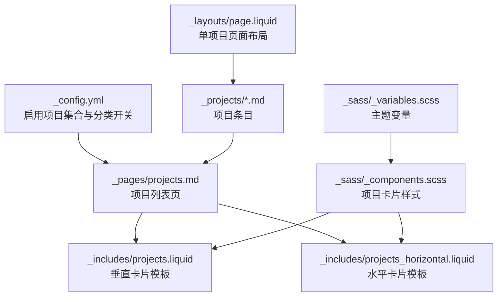
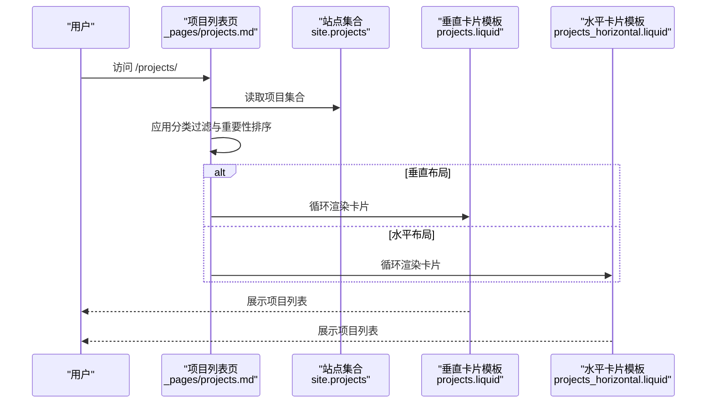
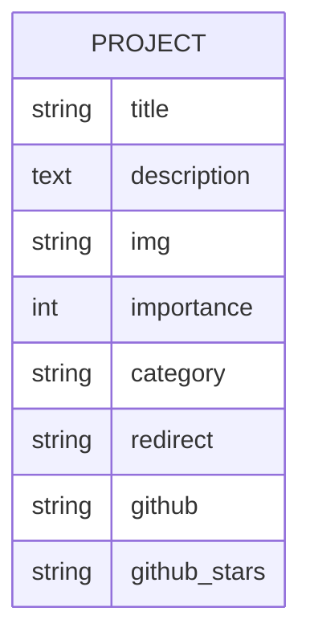
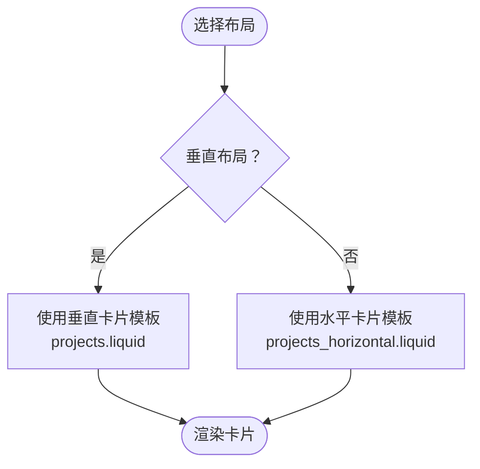
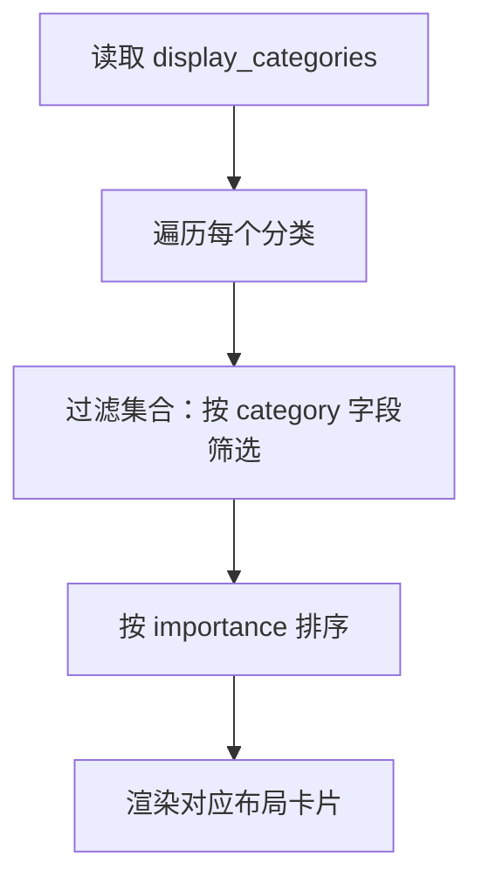
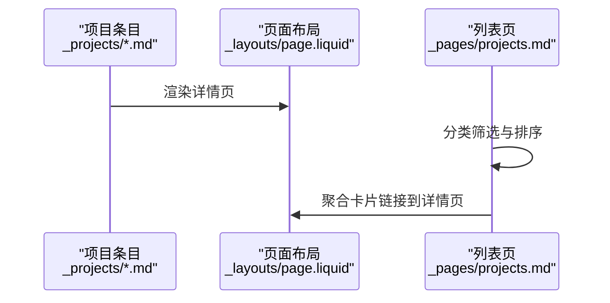
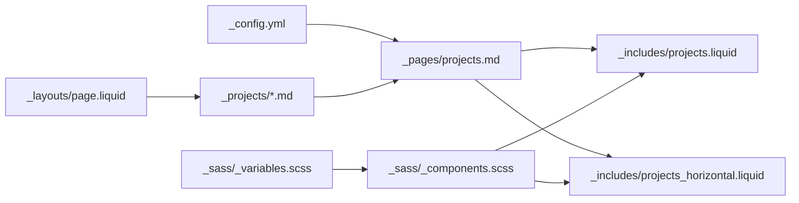

# 项目作品集展示

<cite>
**本文引用的文件**
- [_config.yml](file://_config.yml)
- [_pages/projects.md](file://_pages/projects.md)
- [_pages/zh/projects.md](file://_pages/zh/projects.md)
- [_projects/1_project.md](file://_projects/1_project.md)
- [_projects/2_project.md](file://_projects/2_project.md)
- [_projects/3_project.md](file://_projects/3_project.md)
- [_includes/projects.liquid](file://_includes/projects.liquid)
- [_includes/projects_horizontal.liquid](file://_includes/projects_horizontal.liquid)
- [_layouts/page.liquid](file://_layouts/page.liquid)
- [_sass/_components.scss](file://_sass/_components.scss)
- [_sass/_variables.scss](file://_sass/_variables.scss)
- [README.md](file://README.md)
- [CUSTOMIZE.md](file://CUSTOMIZE.md)
- [.github/instructions/markdown-content.instructions.md](file://.github/instructions/markdown-content.instructions.md)
</cite>

## 目录
1. [简介](#简介)
2. [项目结构](#项目结构)
3. [核心组件](#核心组件)
4. [架构总览](#架构总览)
5. [详细组件分析](#详细组件分析)
6. [依赖关系分析](#依赖关系分析)
7. [性能考量](#性能考量)
8. [故障排查指南](#故障排查指南)
9. [结论](#结论)
10. [附录](#附录)

## 简介
本文件面向“项目作品集展示”功能，系统化阐述项目数据模型、分类与重要性排序、标签系统、项目卡片布局（垂直与水平）、分类配置与筛选、元数据字段说明、实际条目编写示例与最佳实践，以及项目页面的自动生成与个性化定制。

## 项目结构
- 配置层：通过站点配置启用项目集合与分类功能，并控制全局行为（如是否启用项目分类）。
- 页面层：项目列表页负责聚合与展示项目，支持按分类分组与重要性排序。
- 内容层：每个项目以 Markdown 条目形式存放在集合目录中，使用 Front Matter 定义元数据。
- 模板层：通过 Liquid 模板渲染项目卡片，提供垂直与水平两种布局。
- 样式层：通过 SCSS 组件样式统一卡片、网格与响应式布局。

图表来源
- [_config.yml](file://_config.yml)
- [_pages/projects.md](file://_pages/projects.md)
- [_includes/projects.liquid](file://_includes/projects.liquid)
- [_includes/projects_horizontal.liquid](file://_includes/projects_horizontal.liquid)
- [_projects/1_project.md](file://_projects/1_project.md)
- [_layouts/page.liquid](file://_layouts/page.liquid)
- [_sass/_components.scss](file://_sass/_components.scss)
- [_sass/_variables.scss](file://_sass/_variables.scss)

章节来源
- [_config.yml](file://_config.yml)
- [_pages/projects.md](file://_pages/projects.md)
- [_sass/_components.scss](file://_sass/_components.scss)

## 核心组件
- 项目集合与分类开关
  - 在站点配置中启用项目集合输出，并通过全局开关控制是否启用项目分类功能。
- 项目列表页
  - 列表页通过 Front Matter 声明显示分类与布局模式；根据配置从集合中读取并按重要性排序。
- 项目卡片模板
  - 提供垂直与水平两种卡片模板，均支持图片、标题、描述与 GitHub 仓库入口。
- 单项目页面布局
  - 使用通用页面布局渲染项目详情页，支持引用与评论等扩展区域。
- 样式与主题
  - 通过 SCSS 组件样式统一卡片外观与网格布局，变量文件提供主题色与尺寸控制。

章节来源
- [_config.yml](file://_config.yml)
- [_pages/projects.md](file://_pages/projects.md)
- [_includes/projects.liquid](file://_includes/projects.liquid)
- [_includes/projects_horizontal.liquid](file://_includes/projects_horizontal.liquid)
- [_layouts/page.liquid](file://_layouts/page.liquid)
- [_sass/_components.scss](file://_sass/_components.scss)
- [_sass/_variables.scss](file://_sass/_variables.scss)

## 架构总览
项目作品集的生成流程由“内容—模板—样式—页面”四层构成：内容层提供项目条目，模板层负责卡片渲染，样式层统一视觉风格，页面层组织列表与详情。

图表来源
- [_pages/projects.md](file://_pages/projects.md)
- [_includes/projects.liquid](file://_includes/projects.liquid)
- [_includes/projects_horizontal.liquid](file://_includes/projects_horizontal.liquid)

## 详细组件分析

### 数据模型与管理
- 集合与输出
  - 项目集合在站点配置中声明并开启输出，使每个项目条目可被站点集合识别与渲染。
- 元数据字段
  - 必填字段：标题、描述、图片路径、重要性排序值、分类标识。
  - 可选字段：外部跳转链接、GitHub 仓库地址、仓库星标占位等。
- 排序规则
  - 列表页按“重要性”字段进行升序或降序排列，用于突出优先级高的项目。
- 分类与筛选
  - 列表页通过 Front Matter 的分类数组进行分组展示；未启用分类时则整体排序展示。

图表来源
- [_pages/projects.md](file://_pages/projects.md)
- [_projects/1_project.md](file://_projects/1_project.md)
- [_projects/2_project.md](file://_projects/2_project.md)
- [_projects/3_project.md](file://_projects/3_project.md)

章节来源
- [_config.yml](file://_config.yml)
- [_pages/projects.md](file://_pages/projects.md)
- [_projects/1_project.md](file://_projects/1_project.md)
- [_projects/2_project.md](file://_projects/2_project.md)
- [_projects/3_project.md](file://_projects/3_project.md)

### 项目卡片布局（垂直 vs 水平）
- 垂直布局（默认）
  - 适合密集展示，每列一个卡片，图片在上、文字在下，适合移动端与小屏。
- 水平布局
  - 图文左右分栏，图片在左、文字在右，信息密度更高，适合桌面端。
- 布局切换
  - 通过列表页 Front Matter 的布尔字段控制，无需修改模板即可切换。

图表来源
- [_pages/projects.md](file://_pages/projects.md)
- [_includes/projects.liquid](file://_includes/projects.liquid)
- [_includes/projects_horizontal.liquid](file://_includes/projects_horizontal.liquid)

章节来源
- [_pages/projects.md](file://_pages/projects.md)
- [_includes/projects.liquid](file://_includes/projects.liquid)
- [_includes/projects_horizontal.liquid](file://_includes/projects_horizontal.liquid)

### 项目分类功能与配置
- 启用方式
  - 在站点配置中开启项目集合输出与分类功能；列表页通过 Front Matter 的分类数组决定展示哪些类别。
- 多分类支持
  - 列表页会遍历分类数组，逐类筛选并渲染对应项目。
- 筛选机制
  - 使用集合过滤器按分类字段筛选，再按重要性排序，最后渲染卡片。

图表来源
- [_pages/projects.md](file://_pages/projects.md)

章节来源
- [_pages/projects.md](file://_pages/projects.md)
- [_config.yml](file://_config.yml)

### 项目页面自动生成与个性化
- 自动生成
  - 每个项目条目作为独立页面，使用页面布局渲染详情内容；列表页聚合所有项目并按分类与排序展示。
- 个性化定制
  - 通过 Front Matter 控制页面标题、描述、导航与布局；通过样式文件调整卡片外观与网格。
- 多语言支持
  - 提供中英文项目页示例，分别设置语言与导航可见性。

图表来源
- [_layouts/page.liquid](file://_layouts/page.liquid)
- [_pages/projects.md](file://_pages/projects.md)
- [_projects/1_project.md](file://_projects/1_project.md)

章节来源
- [_layouts/page.liquid](file://_layouts/page.liquid)
- [_pages/projects.md](file://_pages/projects.md)
- [_pages/zh/projects.md](file://_pages/zh/projects.md)

### 样式与主题
- 卡片样式
  - 统一卡片背景、标题颜色、内边距与图片尺寸；悬停态主题色变化增强交互体验。
- 网格与响应式
  - 通过 SCSS 变量控制最大宽度与网格项尺寸，适配不同屏幕尺寸。
- 主题变量
  - 提供颜色、字体与间距等变量，便于统一主题风格。

章节来源
- [_sass/_components.scss](file://_sass/_components.scss)
- [_sass/_variables.scss](file://_sass/_variables.scss)

## 依赖关系分析
- 配置依赖
  - 列表页依赖站点配置中的集合输出与分类开关；条目依赖集合命名规范。
- 模板依赖
  - 列表页依赖两个卡片模板；卡片模板依赖通用图片组件与图标库。
- 样式依赖
  - 卡片样式依赖组件样式与变量文件；变量文件影响全局主题。

图表来源
- [_config.yml](file://_config.yml)
- [_pages/projects.md](file://_pages/projects.md)
- [_includes/projects.liquid](file://_includes/projects.liquid)
- [_includes/projects_horizontal.liquid](file://_includes/projects_horizontal.liquid)
- [_projects/1_project.md](file://_projects/1_project.md)
- [_layouts/page.liquid](file://_layouts/page.liquid)
- [_sass/_components.scss](file://_sass/_components.scss)
- [_sass/_variables.scss](file://_sass/_variables.scss)

章节来源
- [_config.yml](file://_config.yml)
- [_pages/projects.md](file://_pages/projects.md)
- [_includes/projects.liquid](file://_includes/projects.liquid)
- [_includes/projects_horizontal.liquid](file://_includes/projects_horizontal.liquid)
- [_projects/1_project.md](file://_projects/1_project.md)
- [_layouts/page.liquid](file://_layouts/page.liquid)
- [_sass/_components.scss](file://_sass/_components.scss)
- [_sass/_variables.scss](file://_sass/_variables.scss)

## 性能考量
- 图片加载
  - 卡片模板使用预加载策略与响应式尺寸，有助于提升首屏渲染速度与减少重排。
- 布局渲染
  - 垂直布局在移动端更友好，水平布局在桌面端信息密度更高；根据访问设备选择合适布局可改善用户体验。
- 样式体积
  - 组件样式集中管理，避免重复定义；变量文件统一主题，减少维护成本。

## 故障排查指南
- 项目未出现在列表页
  - 检查站点配置是否启用项目集合输出；确认条目 Front Matter 字段是否正确。
- 分类不生效
  - 确认列表页 Front Matter 中的分类数组与条目分类字段一致；检查分类大小写与拼写。
- 布局异常
  - 检查列表页布局开关与卡片模板是否匹配；确认样式文件未被覆盖或禁用。
- 图片不显示
  - 确认图片路径有效且与模板中使用的尺寸参数兼容；检查图片格式与加载策略。

章节来源
- [_pages/projects.md](file://_pages/projects.md)
- [_includes/projects.liquid](file://_includes/projects.liquid)
- [_includes/projects_horizontal.liquid](file://_includes/projects_horizontal.liquid)
- [_sass/_components.scss](file://_sass/_components.scss)

## 结论
本作品集展示功能以集合与模板为核心，结合配置驱动的分类与排序，提供灵活的卡片布局与统一的样式体系。通过清晰的元数据模型与页面自动生成机制，用户可以高效地组织与呈现项目成果，并根据需求进行个性化定制。

## 附录

### 项目元数据字段说明
- 必填字段
  - 标题：用于卡片标题与页面标题。
  - 描述：用于卡片摘要与页面描述。
  - 图片：用于卡片缩略图。
  - 重要性：用于排序权重。
  - 分类：用于分类筛选。
- 可选字段
  - 外部跳转链接：用于直接跳转到外部页面。
  - GitHub 仓库地址：用于展示代码仓库入口。
  - 仓库星标占位：用于展示星标统计的占位元素。

章节来源
- [_pages/projects.md](file://_pages/projects.md)
- [_projects/1_project.md](file://_projects/1_project.md)
- [_projects/2_project.md](file://_projects/2_project.md)
- [_projects/3_project.md](file://_projects/3_project.md)

### 实际项目条目编写示例与最佳实践
- 示例条目
  - 参考现有条目文件，确保 Front Matter 字段齐全且格式正确。
- 最佳实践
  - 使用语义化分类名称；为图片提供合适的尺寸与格式；合理设置重要性数值以体现优先级；在详情页补充技术栈、链接与成果说明。

章节来源
- [_projects/1_project.md](file://_projects/1_project.md)
- [_projects/2_project.md](file://_projects/2_project.md)
- [_projects/3_project.md](file://_projects/3_project.md)
- [.github/instructions/markdown-content.instructions.md](file://.github/instructions/markdown-content.instructions.md)

### 项目页面自动生成与个性化定制
- 自动化
  - 列表页自动聚合集合条目并渲染卡片；详情页基于页面布局渲染内容。
- 定制化
  - 通过 Front Matter 控制页面标题、描述、导航与布局；通过样式文件调整卡片外观与网格。

章节来源
- [_pages/projects.md](file://_pages/projects.md)
- [_layouts/page.liquid](file://_layouts/page.liquid)
- [_sass/_components.scss](file://_sass/_components.scss)
- [README.md](file://README.md)
- [CUSTOMIZE.md](file://CUSTOMIZE.md)