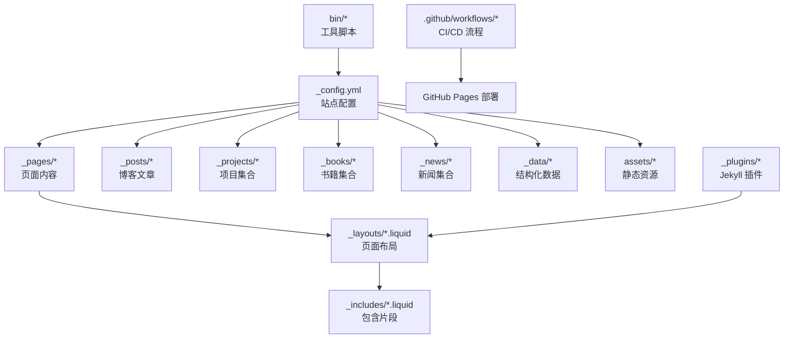
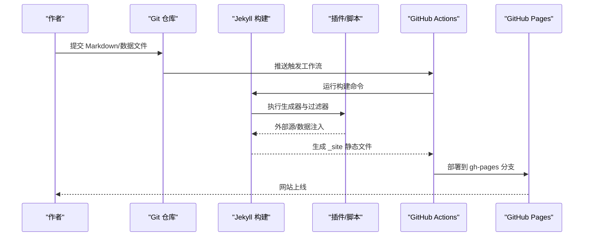
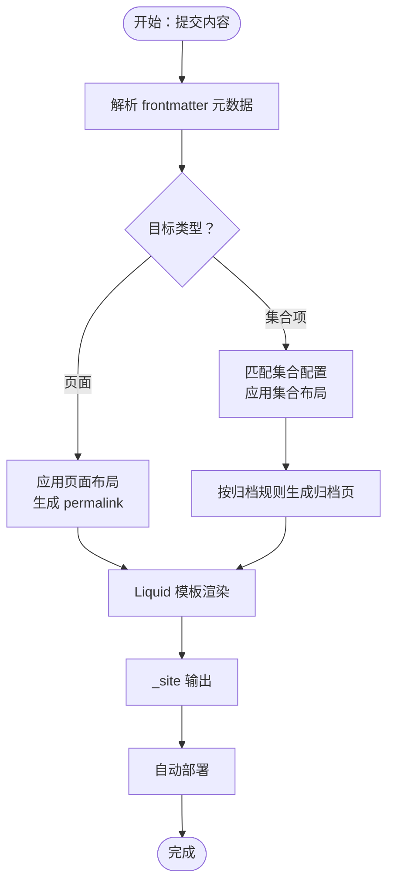
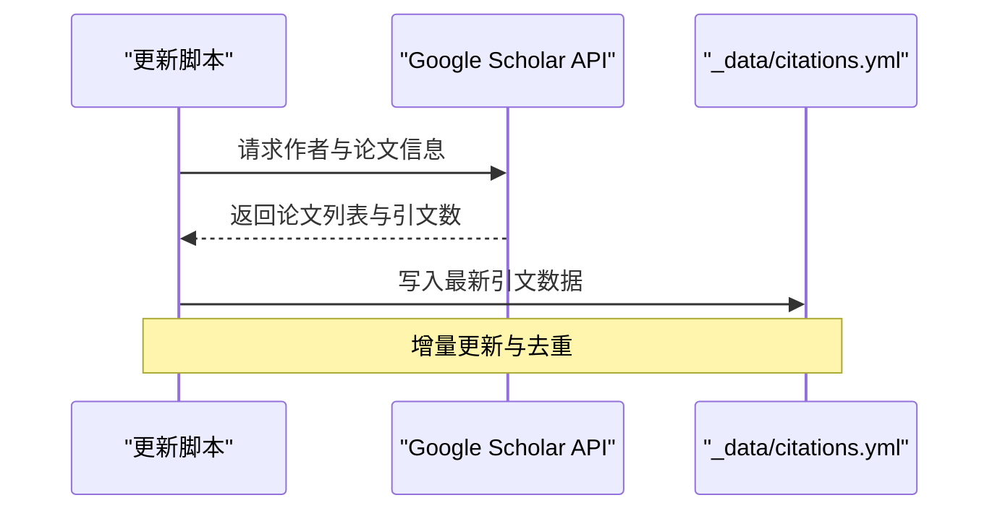
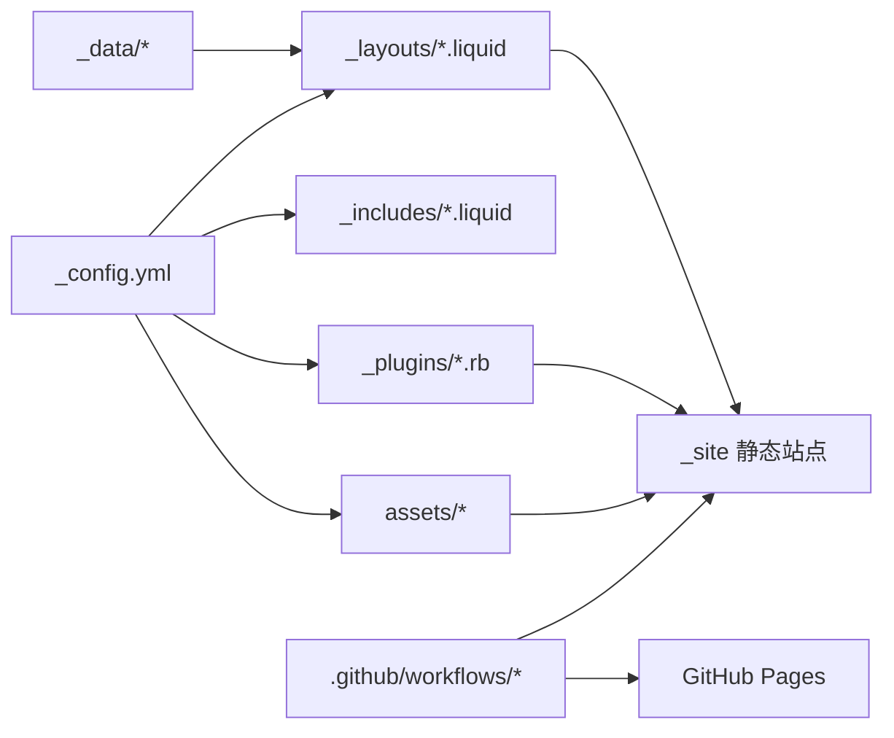

# 项目内容管理

<cite>
**本文档引用的文件**
- [_config.yml](file://_config.yml)
- [README.md](file://README.md)
- [CUSTOMIZE.md](file://CUSTOMIZE.md)
- [INSTALL.md](file://INSTALL.md)
- [QUICKSTART.md](file://QUICKSTART.md)
- [_pages/about.md](file://_pages/about.md)
- [_pages/projects.md](file://_pages/projects.md)
- [_projects/1_project.md](file://_projects/1_project.md)
- [_books/the_godfather.md](file://_books/the_godfather.md)
- [_layouts/page.liquid](file://_layouts/page.liquid)
- [_plugins/details.rb](file://_plugins/details.rb)
- [_plugins/external-posts.rb](file://_plugins/external-posts.rb)
- [bin/update_scholar_citations.py](file://bin/update_scholar_citations.py)
- [.github/workflows/deploy.yml](file://.github/workflows/deploy.yml)
- [.github/workflows/render-cv.yml](file://.github/workflows/render-cv.yml)
</cite>

## 目录
1. [简介](#简介)
2. [项目结构](#项目结构)
3. [核心组件](#核心组件)
4. [架构总览](#架构总览)
5. [详细组件分析](#详细组件分析)
6. [依赖关系分析](#依赖关系分析)
7. [性能考虑](#性能考虑)
8. [故障排除指南](#故障排除指南)
9. [结论](#结论)
10. [附录](#附录)

## 简介
本文件面向使用 al-folio 主题的静态网站（Jekyll）项目，系统性阐述“项目内容管理”的完整流程与最佳实践。内容涵盖：
- 内容组织结构：Markdown 文件命名规范、目录结构与 frontmatter 元数据约定
- 页面自动生成机制：URL 路径生成、页面元数据提取与模板渲染
- 编辑流程：文本内容、图片上传、链接添加等操作步骤
- 个性化定制：布局选择、样式调整、功能扩展
- 最佳实践：写作规范、图片优化、SEO 优化
- 版本管理与备份：Git 工作流、自动部署与回滚策略
- 批量管理与导入导出：集合（collections）与外部源集成

## 项目结构
该仓库采用 Jekyll 的标准分层组织方式，围绕内容、布局、数据与资源进行模块化管理：
- 根配置：[_config.yml](_config.yml) 定义站点信息、插件、集合、归档规则与第三方服务
- 页面与集合：_pages、_posts、_projects、_books、_news 等目录存放 Markdown 内容
- 布局与包含：_layouts、_includes 提供页面骨架与可复用片段
- 数据与资源：_data、assets 存放结构化数据与静态资源（CSS/JS/图片）
- 插件与脚本：_plugins、bin 提供扩展功能与工具脚本
- 自动化：.github/workflows 提供构建、部署与任务编排

图表来源
- [_config.yml](file://_config.yml)
- [_pages/about.md](file://_pages/about.md)
- [_pages/projects.md](file://_pages/projects.md)
- [_projects/1_project.md](file://_projects/1_project.md)
- [_books/the_godfather.md](file://_books/the_godfather.md)
- [_layouts/page.liquid](file://_layouts/page.liquid)

章节来源
- [_config.yml](file://_config.yml)
- [README.md](file://README.md)

## 核心组件
- 站点配置与集合
  - 在 [_config.yml](_config.yml) 中定义集合（如 news、projects）及其输出规则与默认布局
  - 集合项通过 frontmatter 指定布局、标题、描述、分类、标签等元数据
- 页面与布局
  - 页面在 _pages 下以 Markdown 文件形式存在，frontmatter 指定 permalink、layout、nav 等
  - 布局文件（如 page.liquid）负责页面骨架与内容渲染
- 数据与资源
  - _data 存放 YAML/JSON 结构化数据（如社交、仓库、简历），用于动态生成页面
  - assets 存放 CSS、JS、字体、图片等静态资源
- 插件与脚本
  - _plugins 提供自定义 Liquid 标签与生成器（如 details、external-posts）
  - bin 提供 Python 脚本（如更新 Google Scholar 引用量）

章节来源
- [_config.yml](file://_config.yml)
- [_pages/about.md](file://_pages/about.md)
- [_pages/projects.md](file://_pages/projects.md)
- [_layouts/page.liquid](file://_layouts/page.liquid)
- [_plugins/details.rb](file://_plugins/details.rb)
- [_plugins/external-posts.rb](file://_plugins/external-posts.rb)
- [bin/update_scholar_citations.py](file://bin/update_scholar_citations.py)

## 架构总览
下图展示从内容到页面生成与部署的关键路径：内容写入 → Jekyll 渲染 → 静态站点 → 自动部署。

图表来源
- [.github/workflows/deploy.yml](file://.github/workflows/deploy.yml)
- [_plugins/external-posts.rb](file://_plugins/external-posts.rb)
- [bin/update_scholar_citations.py](file://bin/update_scholar_citations.py)

## 详细组件分析

### 组件一：页面与集合的自动生成机制
- URL 路径生成
  - 页面：通过 frontmatter 的 permalink 字段控制；未设置时遵循默认规则
  - 集合：在 [_config.yml](_config.yml) 中配置 collection 的 output 与 permalink 模板
- 元数据提取与渲染
  - frontmatter 中的字段（如 title、description、layout、nav_order、categories、tags 等）由 Jekyll 注入到 Liquid 模板中
  - 布局文件（如 [_layouts/page.liquid](_layouts/page.liquid)）根据 page 变量渲染页面结构
- 归档与分页
  - 使用 jekyll-archives 插件按年/标签/分类生成归档页（参考 [_config.yml](_config.yml) 中 jekyll-archives 配置）

图表来源
- [_config.yml](file://_config.yml)
- [_layouts/page.liquid](file://_layouts/page.liquid)
- [_pages/projects.md](file://_pages/projects.md)

章节来源
- [_config.yml](file://_config.yml)
- [_pages/about.md](file://_pages/about.md)
- [_pages/projects.md](file://_pages/projects.md)
- [_projects/1_project.md](file://_projects/1_project.md)
- [_books/the_godfather.md](file://_books/the_godfather.md)
- [_layouts/page.liquid](file://_layouts/page.liquid)

### 组件二：内容编辑流程（文本、图片、链接）
- 文本内容
  - 在 _pages、_posts、_projects、_books、_news 等目录新增 Markdown 文件，按需填写 frontmatter
  - 使用 Liquid 标签与语法增强内容表现（如 details 标签）
- 图片上传
  - 将图片放入 assets/img 目录或子目录，页面中通过相对路径引用
  - 可启用响应式 WebP 图像与懒加载（见 [_config.yml](_config.yml) 中 imagemagick 与 lazy_loading_images）
- 链接添加
  - 支持外部链接自动 rel/target 属性（见 [_config.yml](_config.yml) 中 external_links）
  - 通过 permalink 控制页面访问路径，确保链接稳定

章节来源
- [_plugins/details.rb](file://_plugins/details.rb)
- [_config.yml](file://_config.yml)

### 组件三：个性化定制（布局、样式、功能）
- 布局选择
  - 在 frontmatter 中指定 layout（如 page、about、post、cv 等）
  - 新增布局可在 _layouts 下创建 .liquid 文件
- 样式调整
  - SCSS 文件位于 _sass，通过变量与混入统一风格
  - 可通过 _config.yml 启用/禁用主题特性（如暗色模式、数学公式、进度条等）
- 功能扩展
  - 添加插件（见 [_config.yml](_config.yml) plugins 列表）
  - 使用 _includes 注入公共片段（如头尾、导航、评论区）

章节来源
- [_config.yml](file://_config.yml)
- [_layouts/page.liquid](file://_layouts/page.liquid)

### 组件四：外部源与自动化（外部文章、引文更新）
- 外部文章抓取
  - 通过 [_plugins/external-posts.rb](_plugins/external-posts.rb) 从 RSS 或 URL 列表抓取内容，注入到 posts 集合
  - 支持默认分类/标签注入与日期解析
- 引文更新
  - 通过 [bin/update_scholar_citations.py](file://bin/update_scholar_citations.py) 获取 Google Scholar 引文数据，写入 _data/citations.yml

图表来源
- [bin/update_scholar_citations.py](file://bin/update_scholar_citations.py)

章节来源
- [_plugins/external-posts.rb](file://_plugins/external-posts.rb)
- [bin/update_scholar_citations.py](file://bin/update_scholar_citations.py)

### 组件五：版本管理与备份策略
- Git 工作流
  - 在 main 分支进行内容与配置修改，自动触发部署工作流
  - 通过分支保护与权限控制（Actions 权限）保障部署安全
- 回滚策略
  - 利用 GitHub Pages 的 gh-pages 分支回滚历史
  - 本地备份：定期导出 _data 与 _bibliography 等关键数据
- 自动化备份
  - GitHub Actions 可将构建产物与中间产物作为工件保存（可选扩展）

章节来源
- [.github/workflows/deploy.yml](file://.github/workflows/deploy.yml)
- [INSTALL.md](file://INSTALL.md)

### 组件六：批量管理与导入导出
- 批量新增集合项
  - 在对应集合目录（如 _projects、_books）批量创建 Markdown 文件，统一 frontmatter 规范
- 导入导出
  - 发表记录：通过 BibTeX 文件集中管理，配合 jekyll-scholar 生成发布页
  - 简历数据：支持 RenderCV 与 JSONResume 两种格式，可同时维护并切换显示
  - 自动化渲染：通过 [render-cv.yml](file://.github/workflows/render-cv.yml) 自动渲染 PDF 并推送到仓库

章节来源
- [_config.yml](file://_config.yml)
- [.github/workflows/render-cv.yml](file://.github/workflows/render-cv.yml)

## 依赖关系分析
- 配置驱动：_config.yml 是内容生成与部署的中枢，决定集合、归档、插件与第三方服务
- 模板渲染：_layouts 与 _includes 通过 Liquid 将数据与内容组合为最终页面
- 插件生态：_plugins 扩展 Jekyll 能力，如 details 标签、外部文章抓取
- 自动化流水线：.github/workflows 完成构建、清理、部署与工件管理

图表来源
- [_config.yml](file://_config.yml)
- [_layouts/page.liquid](file://_layouts/page.liquid)
- [_plugins/details.rb](file://_plugins/details.rb)
- [.github/workflows/deploy.yml](file://.github/workflows/deploy.yml)

章节来源
- [_config.yml](file://_config.yml)
- [_layouts/page.liquid](file://_layouts/page.liquid)
- [_plugins/details.rb](file://_plugins/details.rb)
- [.github/workflows/deploy.yml](file://.github/workflows/deploy.yml)

## 性能考虑
- 资源优化
  - 启用响应式 WebP 图像与懒加载，减少首屏体积与带宽占用
  - 使用压缩与缓存策略（如 jekyll-minifier、terser、purgecss）
- 渲染效率
  - 合理使用集合与归档，避免一次性渲染过多内容
  - 控制外部源抓取频率与并发，防止构建超时
- 部署优化
  - 仅对变更文件触发构建，减少不必要的重新打包

章节来源
- [_config.yml](file://_config.yml)
- [.github/workflows/deploy.yml](file://.github/workflows/deploy.yml)

## 故障排除指南
- 构建失败
  - 检查 Ruby/Python 依赖是否正确安装（Docker 环境推荐）
  - 查看 Actions 日志定位具体错误（容器内执行入口脚本）
- 部署异常
  - 确认 Actions 权限已设为“读写”，分支选择为 gh-pages
  - 核对 _config.yml 中 url/baseurl 设置与实际域名一致
- 内容不生效
  - 确认 frontmatter 字段拼写与类型正确（YAML 对缩进敏感）
  - 使用本地预览验证页面渲染结果

章节来源
- [INSTALL.md](file://INSTALL.md)
- [CUSTOMIZE.md](file://CUSTOMIZE.md)
- [.github/workflows/deploy.yml](file://.github/workflows/deploy.yml)

## 结论
本项目以 Jekyll 为核心，结合丰富的插件与自动化工作流，实现了从内容创作到页面生成与部署的一体化管理。通过规范的目录结构、frontmatter 元数据与集合配置，用户可以高效地组织与发布各类内容；借助自动化与版本控制，确保了内容的持续交付与可追溯性。建议在日常使用中遵循本文档的最佳实践，以获得更稳定、可维护的内容管理体系。

## 附录
- 快速开始：参考 [QUICKSTART.md](file://QUICKSTART.md)，在几分钟内完成站点初始化
- 完整定制：参考 [CUSTOMIZE.md](file://CUSTOMIZE.md)，深入掌握布局、样式与功能扩展
- 安装与部署：参考 [INSTALL.md](file://INSTALL.md)，了解本地开发与多平台部署方案