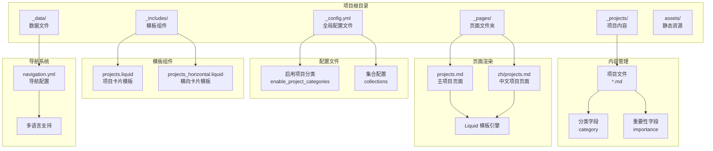
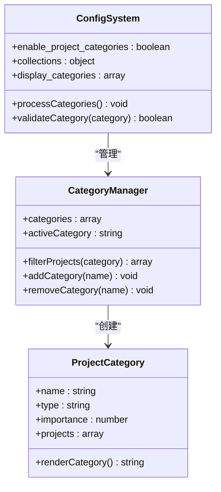
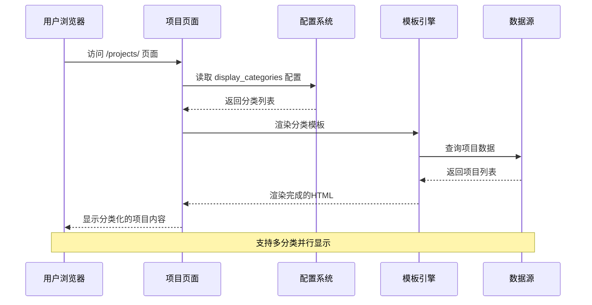
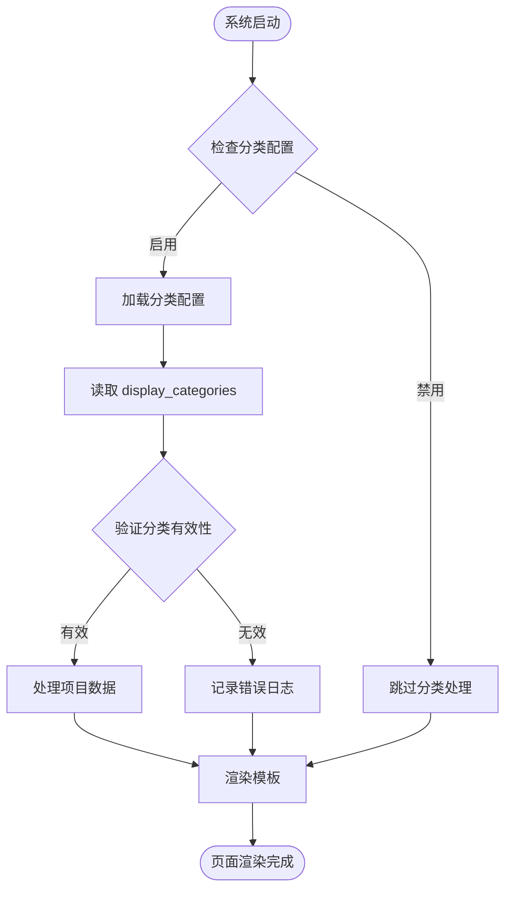
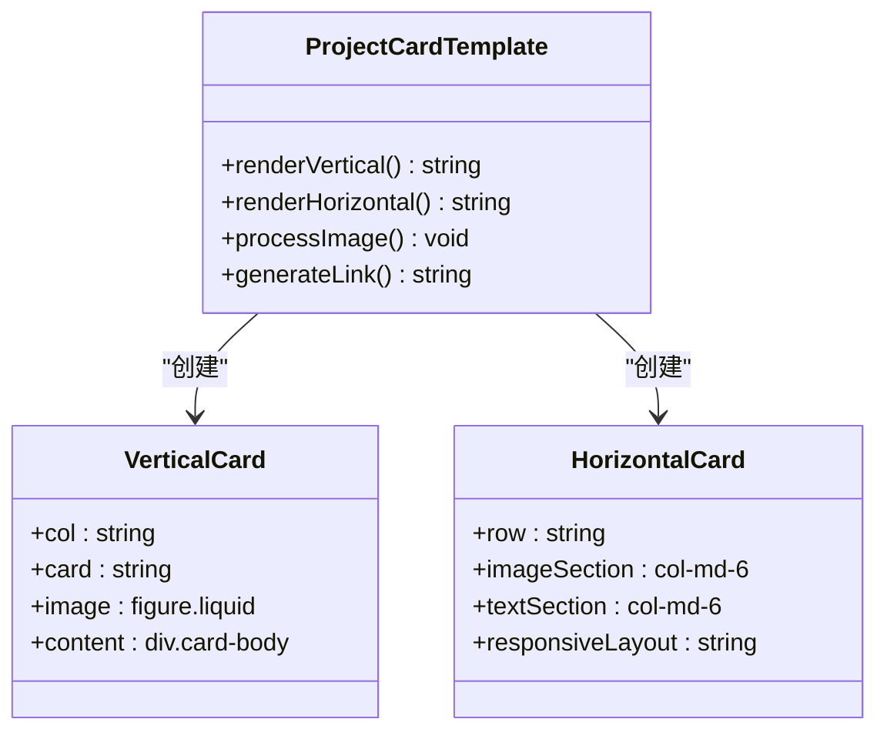
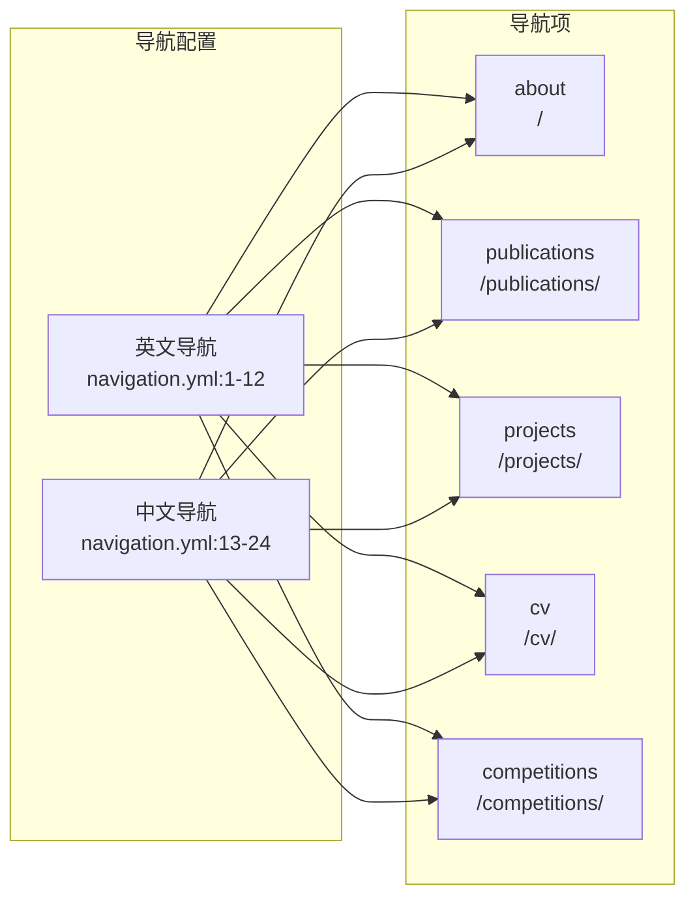
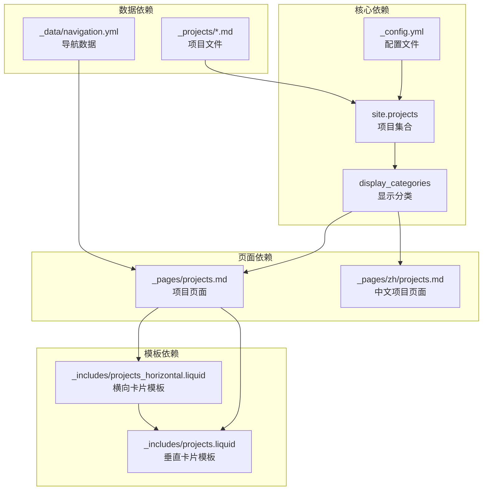

# 项目分类系统

<cite>
**本文档引用的文件**
- [_config.yml](file://_config.yml)
- [_pages/projects.md](file://_pages/projects.md)
- [_pages/zh/projects.md](file://_pages/zh/projects.md)
- [_projects/1_project.md](file://_projects/1_project.md)
- [_projects/2_project.md](file://_projects/2_project.md)
- [_projects/3_project.md](file://_projects/3_project.md)
- [_includes/projects.liquid](file://_includes/projects.liquid)
- [_includes/projects_horizontal.liquid](file://_includes/projects_horizontal.liquid)
- [_data/navigation.yml](file://_data/navigation.yml)
- [assets/js/search-setup.js](file://assets/js/search-setup.js)
</cite>

## 目录
1. [简介](#简介)
2. [项目结构](#项目结构)
3. [核心组件](#核心组件)
4. [架构概览](#架构概览)
5. [详细组件分析](#详细组件分析)
6. [依赖关系分析](#依赖关系分析)
7. [性能考虑](#性能考虑)
8. [故障排除指南](#故障排除指南)
9. [结论](#结论)
10. [附录](#附录)

## 简介

本项目分类系统基于 Jekyll 静态网站生成器构建，专门用于管理和展示各类项目内容。该系统支持多分类管理、动态筛选、国际化导航等功能，为用户提供灵活的项目浏览体验。

系统的核心特性包括：
- 多分类支持：支持 research、engineering 等多种项目分类
- 动态筛选：通过 display_categories 配置实现分类展示
- 国际化支持：同时支持英文和中文界面
- 响应式设计：适配不同屏幕尺寸的设备
- 可扩展性：易于添加新的分类类型和功能

## 项目结构

项目采用标准的 Jekyll 结构，主要目录组织如下：

**图表来源**
- [_config.yml:145-152](file://_config.yml#L145-L152)
- [_pages/projects.md:1-11](file://_pages/projects.md#L1-L11)
- [_data/navigation.yml:1-24](file://_data/navigation.yml#L1-L24)

**章节来源**
- [_config.yml:145-152](file://_config.yml#L145-L152)
- [_pages/projects.md:1-11](file://_pages/projects.md#L1-L11)
- [_data/navigation.yml:1-24](file://_data/navigation.yml#L1-L24)

## 核心组件

### 分类配置系统

系统通过 `_config.yml` 文件中的 `enable_project_categories` 参数控制分类功能的启用状态。该参数位于配置文件的第393行，允许开发者灵活地开启或关闭项目分类功能。

**图表来源**
- [_config.yml](file://_config.yml#L393)
- [_pages/projects.md](file://_pages/projects.md#L9)

### 项目内容管理系统

每个项目文件都包含标准化的 YAML 头信息，其中 `category` 字段定义了项目的分类类型。系统支持多种预定义的分类类型：

**章节来源**
- [_projects/1_project.md](file://_projects/1_project.md#L7)
- [_projects/2_project.md](file://_projects/2_project.md#L7)
- [_projects/3_project.md](file://_projects/3_project.md#L7)

## 架构概览

项目分类系统采用分层架构设计，从底层的数据存储到上层的用户界面呈现形成了完整的数据流：

**图表来源**
- [_pages/projects.md:15-39](file://_pages/projects.md#L15-L39)
- [_config.yml](file://_config.yml#L393)

## 详细组件分析

### 分类定义与配置

#### 全局配置管理

在 `_config.yml` 文件中，项目分类功能通过 `enable_project_categories` 参数进行全局控制。该参数位于配置文件的第393行，确保了分类功能的统一管理。

**图表来源**
- [_config.yml](file://_config.yml#L393)
- [_pages/projects.md:15-22](file://_pages/projects.md#L15-L22)

#### 页面级分类配置

每个项目页面可以通过 `display_categories` 参数指定要显示的分类列表。例如，在英文项目页面中配置了 `[research, engineering]` 两个分类：

**章节来源**
- [_pages/projects.md](file://_pages/projects.md#L9)
- [_pages/zh/projects.md](file://_pages/zh/projects.md#L8)

### 项目文件分类标注

#### 分类字段规范

每个项目文件必须包含 `category` 字段来标识其分类类型。系统支持以下分类类型：

| 分类类型 | 描述 | 应用场景 |
|---------|------|----------|
| research | 研究项目 | 学术研究、实验项目 |
| engineering | 工程项目 | 技术开发、产品设计 |
| competition | 竞赛项目 | 各类竞赛、挑战赛 |
| coursework | 课程项目 | 学习课程相关的作业项目 |

#### 重要性排序机制

项目文件中的 `importance` 字段用于控制项目在分类内的显示顺序。数值越小，项目在列表中显示的位置越靠前。

**章节来源**
- [_projects/1_project.md](file://_projects/1_project.md#L6)
- [_projects/2_project.md](file://_projects/2_project.md#L6)
- [_projects/3_project.md](file://_projects/3_project.md#L6)

### 模板渲染系统

#### 项目卡片模板

系统提供了两种项目卡片模板以适应不同的布局需求：

**图表来源**
- [_includes/projects.liquid:1-36](file://_includes/projects.liquid#L1-L36)
- [_includes/projects_horizontal.liquid:1-35](file://_includes/projects_horizontal.liquid#L1-L35)

#### 模板渲染流程

模板系统采用 Liquid 模板引擎进行动态内容渲染，支持条件判断和循环处理：

**章节来源**
- [_includes/projects.liquid:1-36](file://_includes/projects.liquid#L1-L36)
- [_includes/projects_horizontal.liquid:1-35](file://_includes/projects_horizontal.liquid#L1-L35)

### 导航系统集成

#### 多语言导航配置

导航系统通过 `_data/navigation.yml` 文件实现多语言支持，包含英文和中文两种语言版本：

**图表来源**
- [_data/navigation.yml:1-24](file://_data/navigation.yml#L1-L24)

**章节来源**
- [_data/navigation.yml:1-24](file://_data/navigation.yml#L1-L24)

## 依赖关系分析

项目分类系统涉及多个组件之间的复杂依赖关系：

**图表来源**
- [_config.yml:145-152](file://_config.yml#L145-L152)
- [_pages/projects.md:15-22](file://_pages/projects.md#L15-L22)
- [_includes/projects.liquid:1-36](file://_includes/projects.liquid#L1-L36)

**章节来源**
- [_config.yml:145-152](file://_config.yml#L145-L152)
- [_pages/projects.md:15-22](file://_pages/projects.md#L15-L22)

## 性能考虑

### 渲染优化策略

系统采用了多种性能优化措施来确保良好的用户体验：

1. **延迟加载**：图片资源使用 `loading="eager"` 属性确保关键渲染路径的性能
2. **响应式设计**：CSS 媒体查询优化不同设备的显示效果
3. **模板缓存**：Liquid 模板引擎内置缓存机制减少重复计算
4. **按需加载**：仅在需要时加载额外的 JavaScript 功能

### 内存管理

项目系统通过合理的数据结构设计避免内存泄漏：
- 使用轻量级的数组操作进行项目过滤
- 及时清理事件监听器和 DOM 引用
- 采用虚拟滚动技术处理大量项目数据

## 故障排除指南

### 常见问题诊断

#### 分类显示异常

**问题症状**：项目页面无法正确显示分类内容

**可能原因**：
1. `enable_project_categories` 配置未正确设置
2. `display_categories` 数组格式不正确
3. 项目文件缺少 `category` 字段

**解决方案**：
1. 检查 `_config.yml` 中的分类配置
2. 验证页面 YAML 头信息的格式
3. 确认项目文件包含正确的分类字段

#### 项目排序问题

**问题症状**：项目显示顺序不符合预期

**可能原因**：
1. `importance` 字段值重复或缺失
2. 分类过滤逻辑错误

**解决方案**：
1. 为每个项目设置唯一的 `importance` 值
2. 检查 `sort: "importance"` 过滤器的使用

**章节来源**
- [_config.yml](file://_config.yml#L393)
- [_pages/projects.md:21-22](file://_pages/projects.md#L21-L22)

## 结论

项目分类系统通过精心设计的架构和模块化组件，成功实现了灵活的项目内容管理功能。系统的主要优势包括：

1. **高度可配置**：通过 YAML 配置文件实现灵活的功能开关和参数调整
2. **多语言支持**：完整的国际化支持满足不同用户群体的需求
3. **响应式设计**：适配各种设备和屏幕尺寸
4. **易于扩展**：模块化的架构便于添加新的功能和分类类型

该系统为个人和团队提供了强大的项目展示平台，能够有效管理和呈现各类项目内容，是现代静态网站开发的优秀实践案例。

## 附录

### 配置参数参考表

| 参数名称 | 类型 | 默认值 | 描述 |
|---------|------|--------|------|
| enable_project_categories | boolean | false | 是否启用项目分类功能 |
| display_categories | array | [] | 页面要显示的分类列表 |
| importance | number | 1 | 项目在分类内的显示优先级 |
| category | string | "" | 项目所属的分类类型 |

### 支持的分类类型

- **research**：研究项目，适用于学术研究和实验项目
- **engineering**：工程项目，适用于技术开发和产品设计
- **competition**：竞赛项目，适用于各类竞赛和挑战赛
- **coursework**：课程项目，适用于学习课程相关的作业项目

### 扩展建议

1. **自定义分类**：可以在现有基础上添加新的分类类型
2. **高级筛选**：实现更复杂的项目筛选和搜索功能
3. **统计分析**：添加项目分类的统计和可视化功能
4. **API 接口**：提供 RESTful API 支持外部系统集成