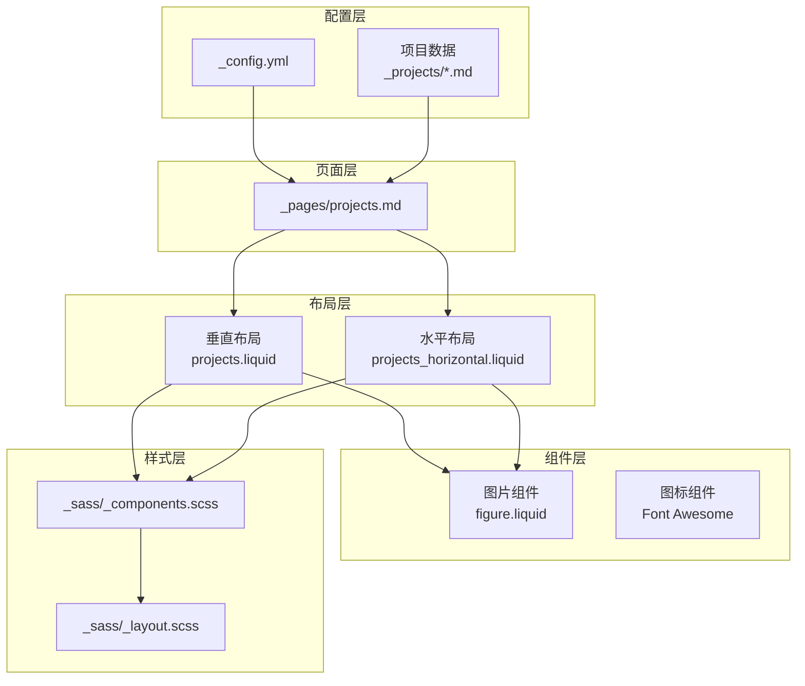
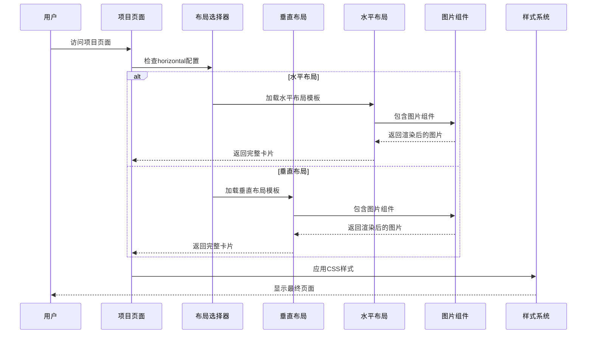
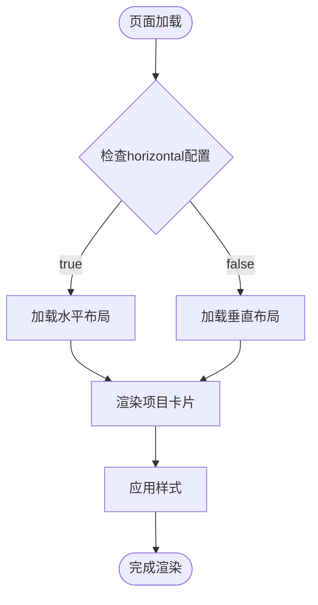
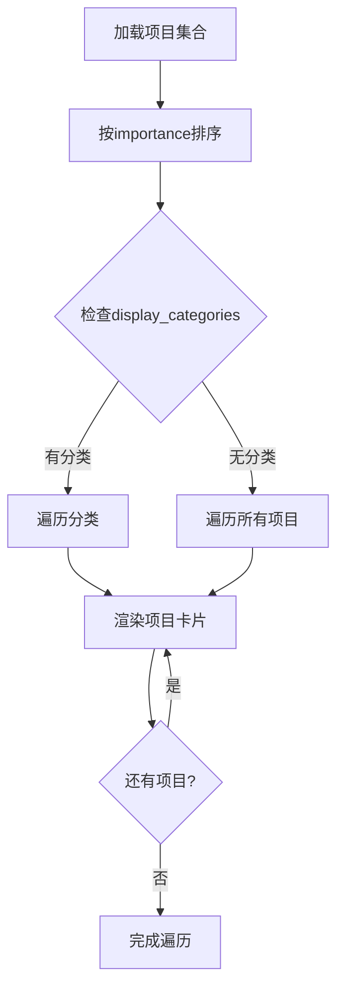
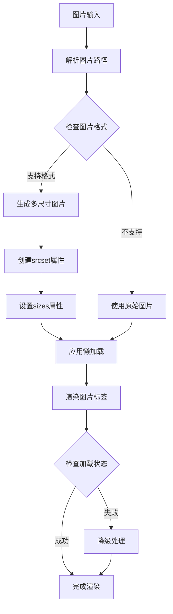
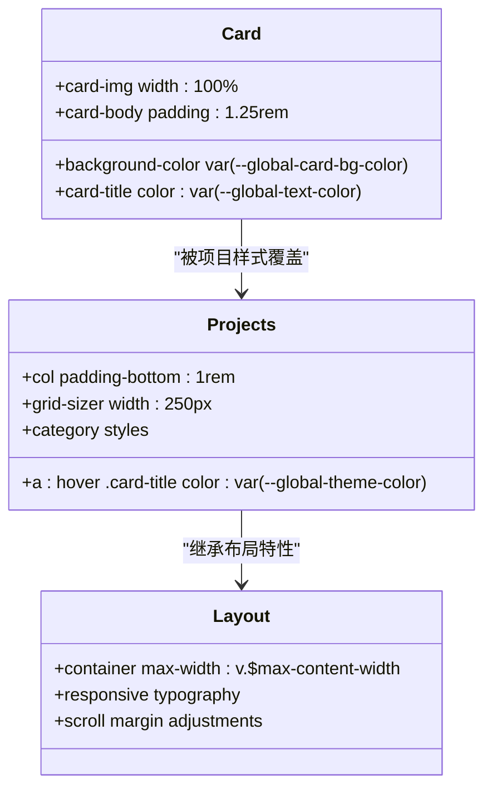

# 项目布局系统

<cite>
**本文档引用的文件**
- [_includes/projects.liquid](file://_includes/projects.liquid)
- [_includes/projects_horizontal.liquid](file://_includes/projects_horizontal.liquid)
- [_pages/projects.md](file://_pages/projects.md)
- [_includes/figure.liquid](file://_includes/figure.liquid)
- [_sass/_components.scss](file://_sass/_components.scss)
- [_sass/_layout.scss](file://_sass/_layout.scss)
- [_config.yml](file://_config.yml)
- [_projects/1_project.md](file://_projects/1_project.md)
- [_projects/2_project.md](file://_projects/2_project.md)
- [assets/js/masonry.js](file://assets/js/masonry.js)
- [assets/js/common.js](file://assets/js/common.js)
</cite>

## 目录
1. [简介](#简介)
2. [项目结构](#项目结构)
3. [核心组件](#核心组件)
4. [架构概览](#架构概览)
5. [详细组件分析](#详细组件分析)
6. [依赖关系分析](#依赖关系分析)
7. [性能考虑](#性能考虑)
8. [故障排除指南](#故障排除指南)
9. [结论](#结论)

## 简介

项目布局系统是该Jekyll网站的核心功能模块，负责展示和管理项目内容。系统提供了两种主要的项目卡片布局模式：垂直布局和水平布局，支持响应式设计和现代化的图片处理机制。

该系统基于Jekyll的Liquid模板引擎构建，采用模块化设计，通过可重用的Liquid包含文件实现灵活的内容渲染。系统支持项目分类、排序、图片懒加载、响应式图片生成等多种高级功能。

## 项目结构

项目布局系统由多个层次组成，从页面到组件再到样式层，形成了清晰的分层架构：



**图表来源**
- [_pages/projects.md:1-67](file://_pages/projects.md#L1-L67)
- [_includes/projects.liquid:1-36](file://_includes/projects.liquid#L1-L36)
- [_includes/projects_horizontal.liquid:1-35](file://_includes/projects_horizontal.liquid#L1-L35)

**章节来源**
- [_pages/projects.md:1-67](file://_pages/projects.md#L1-L67)
- [_includes/projects.liquid:1-36](file://_includes/projects.liquid#L1-L36)
- [_includes/projects_horizontal.liquid:1-35](file://_includes/projects_horizontal.liquid#L1-L35)

## 核心组件

### 垂直项目卡片布局

垂直布局是最常用的项目展示方式，适用于单列或网格排列的项目展示。其特点包括：

- **卡片结构**：使用Bootstrap卡片组件，支持悬停效果
- **图片位置**：图片位于卡片顶部，使用`card-img-top`类
- **标题层级**：使用`h2`标签确保语义正确性
- **响应式设计**：在小屏幕上自动调整布局

### 水平项目卡片布局

水平布局专为需要并排展示图片和文字的场景设计：

- **双列结构**：图片和文字内容分别占据半宽区域
- **图片宽度**：图片容器使用`col-md-6`类，确保响应式布局
- **标题层级**：使用`h3`标签，与垂直布局形成差异化
- **条件渲染**：当没有图片时，内容区域自动扩展至全宽

### 图片处理组件

图片处理系统是布局系统的重要组成部分，提供了完整的响应式图片解决方案：

- **格式转换**：自动将图片转换为WebP格式
- **多尺寸生成**：根据配置生成多种分辨率的图片
- **懒加载支持**：默认启用懒加载以提升性能
- **错误处理**：包含图片加载失败的降级机制

**章节来源**
- [_includes/projects.liquid:1-36](file://_includes/projects.liquid#L1-L36)
- [_includes/projects_horizontal.liquid:1-35](file://_includes/projects_horizontal.liquid#L1-L35)
- [_includes/figure.liquid:1-87](file://_includes/figure.liquid#L1-L87)

## 架构概览

项目布局系统采用分层架构设计，各层职责明确，耦合度低：



**图表来源**
- [_pages/projects.md:24-38](file://_pages/projects.md#L24-L38)
- [_includes/projects.liquid:1-36](file://_includes/projects.liquid#L1-L36)
- [_includes/projects_horizontal.liquid:1-35](file://_includes/projects_horizontal.liquid#L1-L35)

## 详细组件分析

### 布局选择机制

布局系统通过页面前言元数据中的`horizontal`字段智能选择合适的布局模板：



**图表来源**
- [_pages/projects.md:9-10](file://_pages/projects.md#L9-L10)
- [_pages/projects.md:24-38](file://_pages/projects.md#L24-L38)

### 项目数据遍历逻辑

项目数据通过Jekyll集合系统进行管理和遍历：



**图表来源**
- [_pages/projects.md:15-38](file://_pages/projects.md#L15-L38)
- [_pages/projects.md:41-65](file://_pages/projects.md#L41-L65)

### 图片处理机制详解

图片处理系统实现了完整的响应式图片生成流程：



**图表来源**
- [_includes/figure.liquid:16-33](file://_includes/figure.liquid#L16-L33)
- [_includes/figure.liquid:34-80](file://_includes/figure.liquid#L34-L80)

### 样式系统架构

样式系统采用CSS变量和媒体查询实现主题化和响应式设计：



**图表来源**
- [_sass/_components.scss:39-54](file://_sass/_components.scss#L39-L54)
- [_sass/_components.scss:127-162](file://_sass/_components.scss#L127-L162)
- [_sass/_layout.scss:32-34](file://_sass/_layout.scss#L32-L34)

**章节来源**
- [_pages/projects.md:15-65](file://_pages/projects.md#L15-L65)
- [_includes/figure.liquid:1-87](file://_includes/figure.liquid#L1-L87)
- [_sass/_components.scss:39-162](file://_sass/_components.scss#L39-L162)
- [_sass/_layout.scss:1-59](file://_sass/_layout.scss#L1-L59)

## 依赖关系分析

项目布局系统的主要依赖关系如下：

```mermaid
graph LR
subgraph "外部依赖"
Bootstrap[Bootstrap CSS框架]
Font Awesome[Font Awesome图标库]
jQuery[jQuery库]
Masonry[Masonry布局库]
end
subgraph "内部组件"
ProjectsPage[项目页面]
VerticalLayout[垂直布局模板]
HorizontalLayout[水平布局模板]
FigureComponent[图片组件]
StyleSystem[样式系统]
end
ProjectsPage --> VerticalLayout
ProjectsPage --> HorizontalLayout
VerticalLayout --> FigureComponent
HorizontalLayout --> FigureComponent
VerticalLayout --> StyleSystem
HorizontalLayout --> StyleSystem
StyleSystem --> Bootstrap
StyleSystem --> Font Awesome
ProjectsPage --> jQuery
ProjectsPage --> Masonry
```

**图表来源**
- [_config.yml:398-634](file://_config.yml#L398-L634)
- [_pages/projects.md:1-67](file://_pages/projects.md#L1-L67)

**章节来源**
- [_config.yml:398-634](file://_config.yml#L398-L634)
- [_pages/projects.md:1-67](file://_pages/projects.md#L1-L67)

## 性能考虑

### 图片优化策略

系统实现了多层次的图片优化机制：

- **自动格式转换**：将图片转换为WebP格式，减少文件大小
- **多尺寸生成**：根据配置生成480px、800px、1400px等不同分辨率
- **懒加载支持**：默认启用图片懒加载，提升首屏加载速度
- **缓存策略**：使用文件缓存机制避免重复处理

### JavaScript优化

- **延迟加载**：非关键JavaScript在页面加载后异步执行
- **事件委托**：使用事件委托减少DOM绑定数量
- **图片加载监听**：通过imagesLoaded库优化布局计算时机

### CSS优化

- **变量化设计**：使用CSS变量实现主题统一管理
- **媒体查询优化**：合理使用断点确保移动端性能
- **选择器优化**：避免深层嵌套选择器提高渲染效率

## 故障排除指南

### 常见问题及解决方案

**问题1：图片未显示**
- 检查图片路径是否正确
- 确认图片格式是否受支持
- 验证Imagemagick插件是否正确配置

**问题2：布局错乱**
- 检查Bootstrap类名是否正确
- 验证CSS文件是否正确加载
- 确认媒体查询断点设置

**问题3：响应式图片不生效**
- 检查Imagemagick配置参数
- 验证sizes属性设置
- 确认浏览器对WebP的支持情况

**章节来源**
- [_includes/figure.liquid:79-80](file://_includes/figure.liquid#L79-L80)
- [_config.yml:352-375](file://_config.yml#L352-L375)

## 结论

项目布局系统通过模块化设计和响应式架构，为用户提供了灵活且高性能的项目展示解决方案。系统的主要优势包括：

- **灵活性**：支持多种布局模式和自定义选项
- **性能**：内置图片优化和懒加载机制
- **可维护性**：清晰的分层架构便于维护和扩展
- **可访问性**：遵循Web标准和最佳实践

通过合理的配置和使用，开发者可以轻松创建美观且功能丰富的项目展示页面，满足不同场景下的需求。