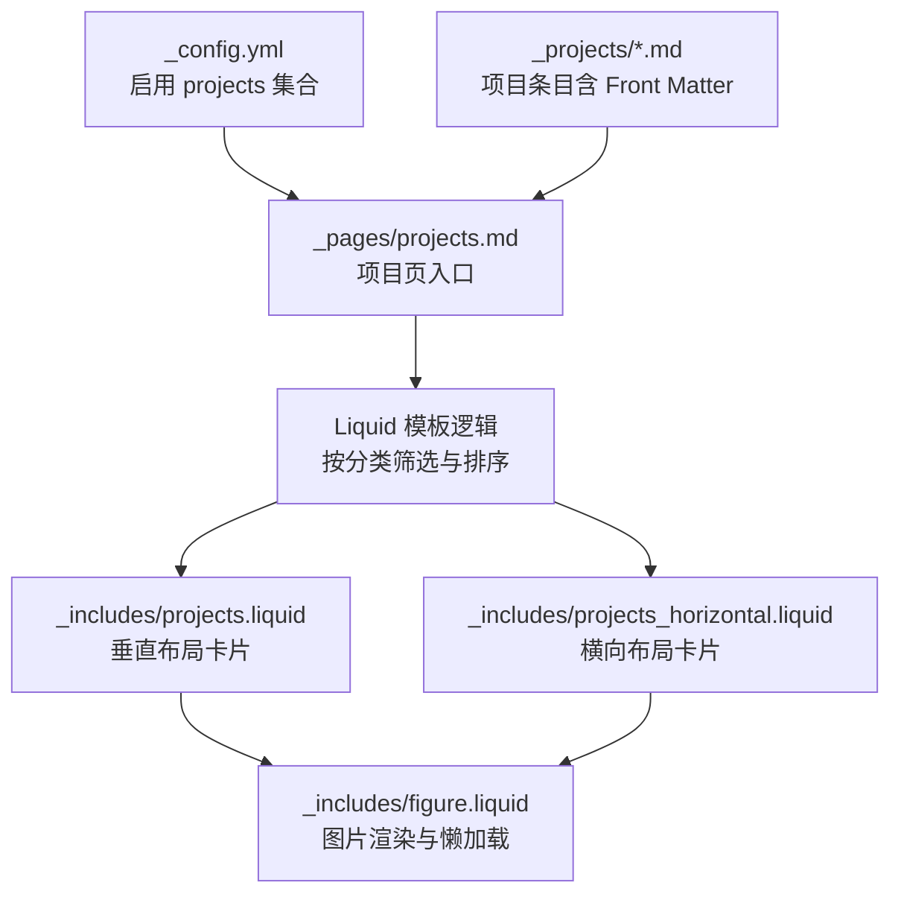
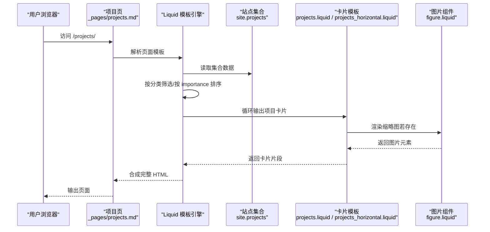
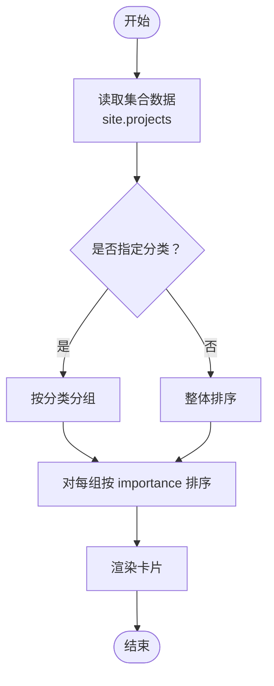
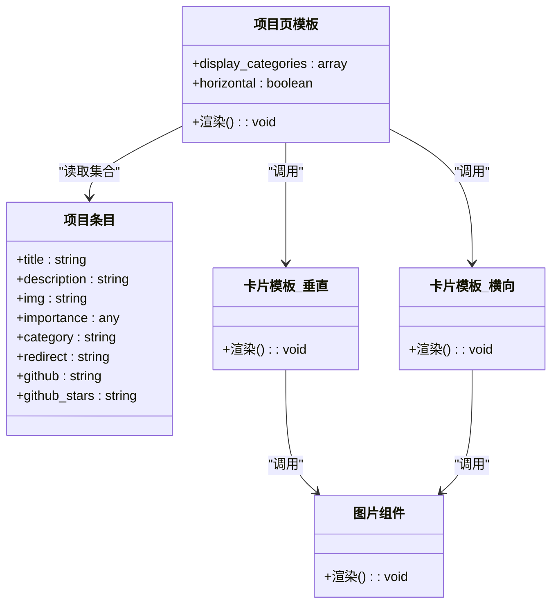
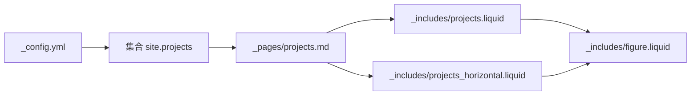

# 项目数据模型

<cite>
**本文引用的文件**
- [_config.yml](file://_config.yml)
- [_pages/projects.md](file://_pages/projects.md)
- [_projects/1_project.md](file://_projects/1_project.md)
- [_projects/2_project.md](file://_projects/2_project.md)
- [_projects/3_project.md](file://_projects/3_project.md)
- [_includes/projects.liquid](file://_includes/projects.liquid)
- [_includes/projects_horizontal.liquid](file://_includes/projects_horizontal.liquid)
- [_includes/figure.liquid](file://_includes/figure.liquid)
- [CUSTOMIZE.md](file://CUSTOMIZE.md)
</cite>

## 目录
1. [简介](#简介)
2. [项目结构](#项目结构)
3. [核心组件](#核心组件)
4. [架构总览](#架构总览)
5. [详细组件分析](#详细组件分析)
6. [依赖关系分析](#依赖关系分析)
7. [性能考量](#性能考量)
8. [故障排查指南](#故障排查指南)
9. [结论](#结论)
10. [附录](#附录)

## 简介
本文件系统化梳理本仓库的“项目”数据模型与渲染流程，重点覆盖以下方面：
- 项目元数据字段：title、description、img、importance、category 的作用与配置方式
- 项目分类系统：research、engineering 等分类类型及其在页面中的呈现差异
- 重要性排序机制：importance 字段如何影响项目卡片的显示优先级
- YAML Front Matter 标准格式与字段校验规则
- 实际项目条目的编写示例与最佳实践
- 项目数据的自动解析与模板渲染过程

## 项目结构
项目集合由 Jekyll 集合（Collection）驱动，默认启用 projects 集合，并在页面中通过 Liquid 模板进行筛选、排序与渲染。

图示来源
- [_config.yml:145-152](file://_config.yml#L145-L152)
- [_pages/projects.md:14-67](file://_pages/projects.md#L14-L67)
- [_includes/projects.liquid:1-36](file://_includes/projects.liquid#L1-L36)
- [_includes/projects_horizontal.liquid:1-35](file://_includes/projects_horizontal.liquid#L1-L35)
- [_includes/figure.liquid:1-87](file://_includes/figure.liquid#L1-L87)

章节来源
- [_config.yml:145-152](file://_config.yml#L145-L152)
- [_pages/projects.md:14-67](file://_pages/projects.md#L14-L67)

## 核心组件
- 项目集合与配置
  - 在站点配置中启用 projects 集合，使项目条目可被 Jekyll 自动发现与索引。
- 项目页面与模板
  - 项目页通过 Liquid 模板读取集合数据，支持按分类筛选与按 importance 排序。
- 项目卡片组件
  - 垂直布局与横向布局两种卡片模板，均从项目对象读取 title、description、img 等字段。
- 图片渲染组件
  - 统一使用 figure.liquid 渲染缩略图，支持响应式与懒加载。

章节来源
- [_config.yml:145-152](file://_config.yml#L145-L152)
- [_pages/projects.md:14-67](file://_pages/projects.md#L14-L67)
- [_includes/projects.liquid:1-36](file://_includes/projects.liquid#L1-L36)
- [_includes/projects_horizontal.liquid:1-35](file://_includes/projects_horizontal.liquid#L1-L35)
- [_includes/figure.liquid:1-87](file://_includes/figure.liquid#L1-L87)

## 架构总览
下图展示了从项目条目到最终页面渲染的关键路径：Front Matter → 集合索引 → 页面模板筛选/排序 → 卡片组件 → 图片组件。

图示来源
- [_pages/projects.md:14-67](file://_pages/projects.md#L14-L67)
- [_includes/projects.liquid:1-36](file://_includes/projects.liquid#L1-L36)
- [_includes/projects_horizontal.liquid:1-35](file://_includes/projects_horizontal.liquid#L1-L35)
- [_includes/figure.liquid:1-87](file://_includes/figure.liquid#L1-L87)

## 详细组件分析

### 元数据字段定义与用法
- title
  - 类型：字符串
  - 作用：项目标题，用于卡片标题与页面标题
  - 示例：参见各项目条目 Front Matter 中的 title 字段
- description
  - 类型：字符串
  - 作用：项目简述，用于卡片描述文本
- img
  - 类型：字符串（路径）
  - 作用：项目缩略图路径；若存在则渲染至卡片顶部
  - 支持：响应式 WebP 与懒加载（由 figure.liquid 控制）
- importance
  - 类型：整数或可排序值
  - 作用：控制项目在页面中的显示优先级；页面模板按 importance 进行升序/降序排序
- category
  - 类型：字符串
  - 作用：项目分类标签；页面模板可按分类分组展示
  - 取值示例：research、engineering 等

章节来源
- [_projects/1_project.md:1-21](file://_projects/1_project.md#L1-L21)
- [_projects/2_project.md:1-21](file://_projects/2_project.md#L1-L21)
- [_projects/3_project.md:1-21](file://_projects/3_project.md#L1-L21)
- [_pages/projects.md:14-67](file://_pages/projects.md#L14-L67)
- [_includes/figure.liquid:1-87](file://_includes/figure.liquid#L1-L87)

### 分类系统与页面行为
- 分类开关
  - 通过站点配置项控制是否启用多分类功能
- 页面分类展示
  - 项目页可通过页面 Front Matter 的 display_categories 指定要展示的分类
  - 模板会先按分类过滤，再对每个分类内的项目按 importance 排序
- 分类差异
  - 不同分类在页面上以分组标题与独立列表呈现，便于用户聚焦特定领域

章节来源
- [_config.yml:393](file://_config.yml#L393)
- [_pages/projects.md:9](file://_pages/projects.md#L9)
- [_pages/projects.md:15-40](file://_pages/projects.md#L15-L40)

### 重要性排序机制
- 排序依据
  - 页面模板对集合数据按 importance 字段进行排序
- 排序方向
  - 模板中默认采用升序；如需降序，可在模板中调整排序参数
- 优先级控制
  - 数值越小优先级越高；可结合业务语义赋予不同数值以表达优先级

图示来源
- [_pages/projects.md:21-22](file://_pages/projects.md#L21-L22)
- [_pages/projects.md:45](file://_pages/projects.md#L45)

章节来源
- [_pages/projects.md:21-22](file://_pages/projects.md#L21-L22)
- [_pages/projects.md:45](file://_pages/projects.md#L45)

### YAML Front Matter 标准格式与字段校验
- 必填字段
  - layout：页面布局标识，项目页通常使用 page
  - title：项目标题
- 常用字段
  - description：项目描述
  - img：缩略图路径
  - importance：排序优先级
  - category：分类标签
- 可选字段
  - redirect：重定向链接
  - github、github_stars：代码仓库与星标信息（卡片模板中可显示）
- 字段校验建议
  - 字符串字段避免特殊字符导致的 YAML 解析错误，必要时使用双引号包裹
  - importance 应为可比较的数值或字符串，确保排序稳定
  - category 应保持一致的拼写与大小写，避免重复分类名

章节来源
- [_projects/1_project.md:1-8](file://_projects/1_project.md#L1-L8)
- [_projects/2_project.md:1-8](file://_projects/2_project.md#L1-L8)
- [_projects/3_project.md:1-8](file://_projects/3_project.md#L1-L8)
- [CUSTOMIZE.md:500-527](file://CUSTOMIZE.md#L500-L527)

### 实际项目条目编写示例与最佳实践
- 示例条目
  - research 类型：包含 title、description、img、importance、category 等字段
  - engineering 类型：同上，category 使用 engineering
- 最佳实践
  - 缩略图路径统一放置于 assets/img 下，命名清晰且与内容相关
  - importance 数值建议连续且语义明确（如 1 最高优先级）
  - category 保持一致性，避免混用相近但不等价的标签
  - 描述简洁明了，突出技术要点与个人贡献

章节来源
- [_projects/1_project.md:1-21](file://_projects/1_project.md#L1-L21)
- [_projects/2_project.md:1-21](file://_projects/2_project.md#L1-L21)
- [_projects/3_project.md:1-21](file://_projects/3_project.md#L1-L21)

### 数据解析与渲染流程
- 数据解析
  - Jekyll 在构建阶段扫描 _projects 目录，解析每个 Markdown 文件的 Front Matter 与正文
  - 将项目条目加入 site.projects 集合，供页面模板访问
- 页面渲染
  - 项目页模板根据 display_categories 过滤集合
  - 对每个分类内的项目按 importance 排序
  - 调用 projects.liquid 或 projects_horizontal.liquid 生成卡片
  - 卡片内部通过 figure.liquid 渲染缩略图，支持响应式与懒加载

图示来源
- [_pages/projects.md:14-67](file://_pages/projects.md#L14-L67)
- [_includes/projects.liquid:1-36](file://_includes/projects.liquid#L1-L36)
- [_includes/projects_horizontal.liquid:1-35](file://_includes/projects_horizontal.liquid#L1-L35)
- [_includes/figure.liquid:1-87](file://_includes/figure.liquid#L1-L87)

## 依赖关系分析
- 配置依赖
  - _config.yml 中启用 projects 集合，是项目数据可用性的前提
- 模板依赖
  - 项目页模板依赖 display_categories 与排序逻辑
  - 卡片模板依赖项目对象的 img、title、description 等字段
  - 图片组件依赖 img 字段与站点配置中的图片处理能力
- 外部依赖
  - 图片懒加载与响应式 WebP 由站点配置与图片组件共同决定

图示来源
- [_config.yml:145-152](file://_config.yml#L145-L152)
- [_pages/projects.md:14-67](file://_pages/projects.md#L14-L67)
- [_includes/projects.liquid:1-36](file://_includes/projects.liquid#L1-L36)
- [_includes/projects_horizontal.liquid:1-35](file://_includes/projects_horizontal.liquid#L1-L35)
- [_includes/figure.liquid:1-87](file://_includes/figure.liquid#L1-L87)

章节来源
- [_config.yml:145-152](file://_config.yml#L145-L152)
- [_pages/projects.md:14-67](file://_pages/projects.md#L14-L67)
- [_includes/projects.liquid:1-36](file://_includes/projects.liquid#L1-L36)
- [_includes/projects_horizontal.liquid:1-35](file://_includes/projects_horizontal.liquid#L1-L35)
- [_includes/figure.liquid:1-87](file://_includes/figure.liquid#L1-L87)

## 性能考量
- 图片优化
  - 启用响应式 WebP 与懒加载可显著降低首屏加载时间
- 排序与过滤
  - 在集合规模较大时，尽量限定 display_categories 以减少渲染开销
- 卡片布局
  - 横向布局在移动端可能增加换行与重排成本，可根据流量来源选择合适布局

## 故障排查指南
- Front Matter 解析失败
  - 检查特殊字符是否正确转义或使用双引号包裹
  - 确认缩进与 YAML 语法规范
- 图片未显示
  - 确认 img 路径有效且存在于 assets/img 下
  - 检查站点配置中图片处理开关与 widths 设置
- 排序异常
  - 确保 importance 字段为可比较类型（数字或字符串）
  - 如需降序，请在模板中调整排序参数
- 分类未生效
  - 确认页面 Front Matter 中 display_categories 与条目 category 一致
  - 检查站点配置中是否启用了分类功能

章节来源
- [CUSTOMIZE.md:500-527](file://CUSTOMIZE.md#L500-L527)
- [_includes/figure.liquid:1-87](file://_includes/figure.liquid#L1-L87)
- [_pages/projects.md:14-67](file://_pages/projects.md#L14-L67)

## 结论
本项目数据模型以 Jekyll 集合为核心，通过标准化的 YAML Front Matter 字段与模板渲染机制，实现了项目条目的高效组织与展示。通过 importance 与 category 的组合使用，既能保证内容优先级的可控，又能满足多维度分类浏览的需求。遵循本文提供的字段规范与最佳实践，可进一步提升维护效率与页面性能。

## 附录
- 字段速查表
  - title：项目标题
  - description：项目描述
  - img：缩略图路径
  - importance：排序优先级
  - category：分类标签
  - redirect：重定向链接
  - github / github_stars：仓库与星标（卡片中可显示）