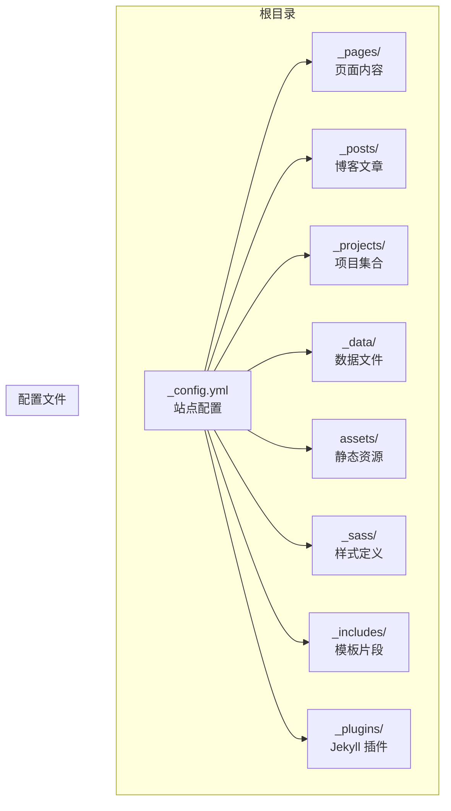
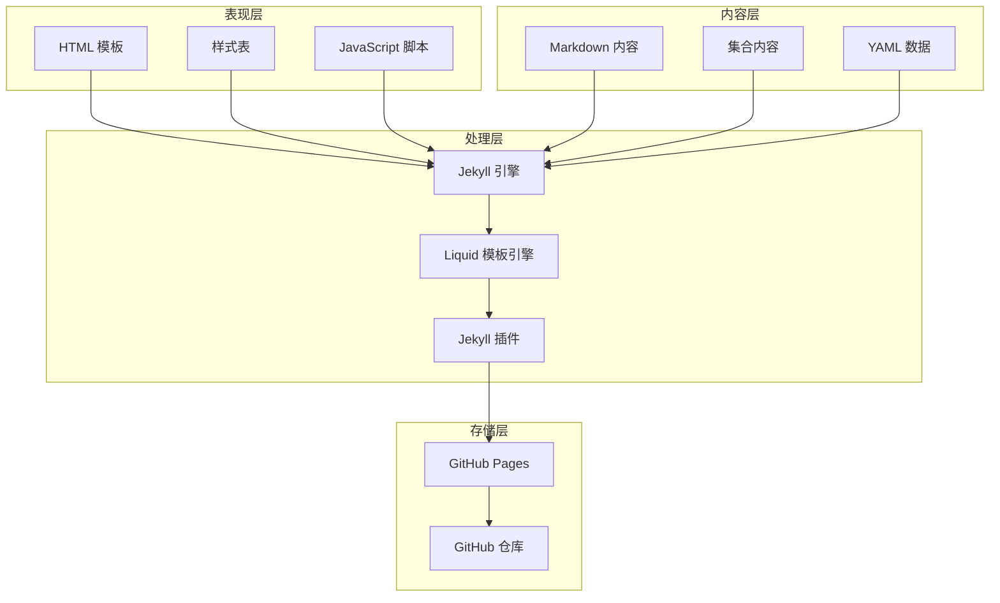
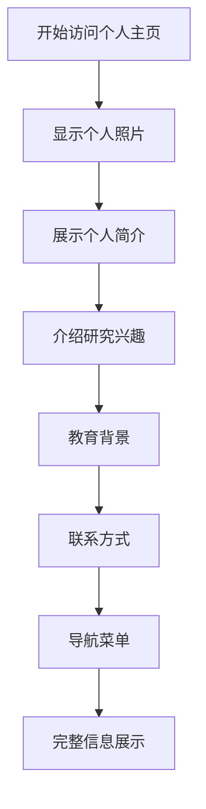
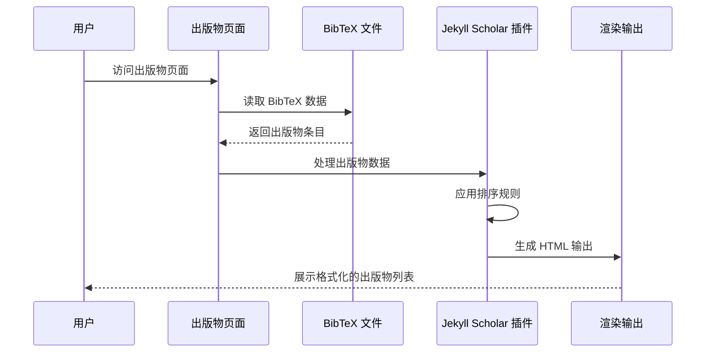
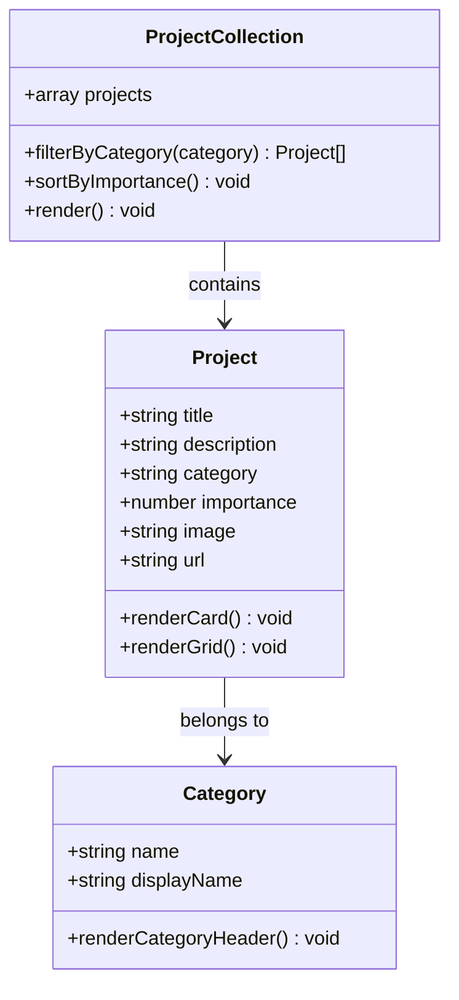
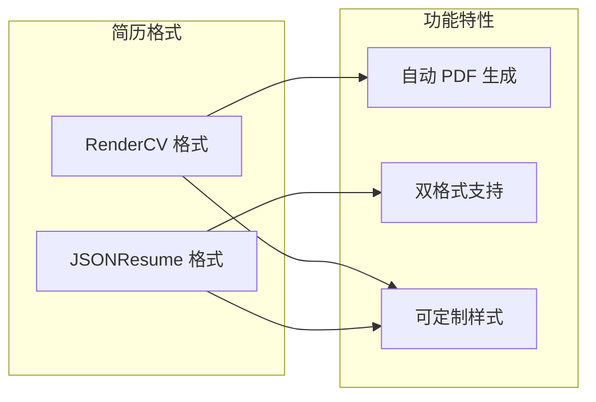
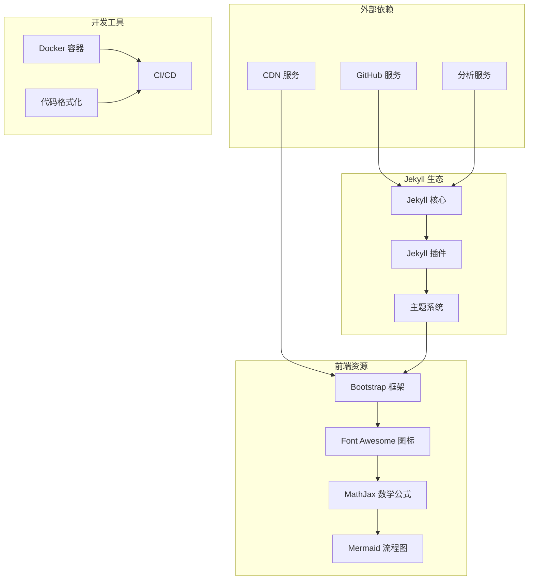

# 项目介绍

<cite>
**本文档引用的文件**
- [README.md](file://README.md)
- [_config.yml](file://_config.yml)
- [INSTALL.md](file://INSTALL.md)
- [QUICKSTART.md](file://QUICKSTART.md)
- [CUSTOMIZE.md](file://CUSTOMIZE.md)
- [FAQ.md](file://FAQ.md)
- [TROUBLESHOOTING.md](file://TROUBLESHOOTING.md)
- [SEO.md](file://SEO.md)
- [ANALYTICS.md](file://ANALYTICS.md)
- [_pages/about.md](file://_pages/about.md)
- [_pages/publications.md](file://_pages/publications.md)
- [_pages/projects.md](file://_pages/projects.md)
- [_pages/cv.md](file://_pages/cv.md)
</cite>

## 目录
1. [简介](#简介)
2. [项目结构](#项目结构)
3. [核心组件](#核心组件)
4. [架构总览](#架构总览)
5. [详细组件分析](#详细组件分析)
6. [依赖关系分析](#依赖关系分析)
7. [性能考虑](#性能考虑)
8. [故障排除指南](#故障排除指南)
9. [结论](#结论)
10. [附录](#附录)

## 简介

本项目是李明宇的个人学术主页，基于 al-folio 主题构建，采用 Jekyll 静态网站生成器技术栈。该项目旨在为学术研究者提供一个专业、简洁且响应式的个人主页解决方案，用于展示学术成果、个人项目、研究经历等内容。

### 什么是学术主页及其重要性

学术主页（Academic Homepage）是研究人员在互联网上的专业门户，具有以下重要作用：
- **学术影响力展示**：集中展示研究成果、论文发表、项目经验
- **职业发展支持**：提升学术声誉，便于合作交流
- **信息统一入口**：整合个人资料、联系方式、研究方向等信息
- **发现性优化**：通过 SEO 和元数据优化提高搜索引擎可见性

### 为什么选择 Jekyll + al-folio

选择 Jekyll 作为技术栈的原因：
- **静态化优势**：无需服务器端运行时，部署简单、安全可靠
- **版本控制友好**：基于 Git 的内容管理，便于协作和备份
- **成本效益高**：可免费托管在 GitHub Pages 上
- **性能优异**：静态页面加载速度快，用户体验佳

al-folio 主题的优势：
- **学术专用设计**：专为学术界定制，符合学术主页的专业要求
- **响应式布局**：适配各种设备和屏幕尺寸
- **丰富的功能模块**：涵盖 CV、出版物、项目、教学等多个方面
- **开箱即用**：预配置了大量学术相关的功能和样式

## 项目结构

该项目采用标准的 Jekyll 项目结构，主要目录和文件组织如下：

**图表来源**
- [_config.yml:1-656](file://_config.yml#L1-L656)
- [CUSTOMIZE.md:99-141](file://CUSTOMIZE.md#L99-L141)

**章节来源**
- [CUSTOMIZE.md:99-141](file://CUSTOMIZE.md#L99-L141)
- [_config.yml:143-191](file://_config.yml#L143-L191)

## 核心组件

### 站点配置系统

项目的核心配置集中在 `_config.yml` 文件中，包含以下关键配置类别：

#### 基础信息配置
- **站点标题和描述**：定义网站的名称、描述和关键词
- **作者信息**：包括姓名、机构、联系方式等
- **语言设置**：支持多语言内容管理

#### 外观和主题配置
- **主题颜色**：可自定义网站的整体色调
- **布局设置**：导航栏固定、页脚固定等界面选项
- **搜索功能**：启用站内搜索、社交媒体搜索等

#### 功能开关配置
- **可选功能**：如数学公式支持、暗色模式、图片懒加载等
- **第三方集成**：统计分析、评论系统、社交媒体等

**章节来源**
- [_config.yml:1-256](file://_config.yml#L1-L256)

### 内容管理系统

项目采用 Jekyll 的集合（Collections）机制来管理不同类型的内容：

#### 默认集合
- **news**：新闻动态集合
- **projects**：项目集合
- **books**：书籍收藏集合
- **teachings**：教学材料集合

#### 自定义集合
项目支持创建自定义集合，如课程、竞赛、作品集等，通过在配置文件中添加集合定义即可启用。

**章节来源**
- [_config.yml:145-152](file://_config.yml#L145-L152)
- [CUSTOMIZE.md:430-503](file://CUSTOMIZE.md#L430-L503)

### 页面布局系统

项目提供了多种页面布局，每种布局针对特定用途：

#### 专用页面布局
- **about**：个人简介页面
- **page**：通用页面布局
- **post**：博客文章布局
- **cv**：简历页面布局
- **profiles**：人员档案页面

#### 布局特性
- **响应式设计**：适配移动设备和桌面设备
- **语义化标记**：符合现代 Web 标准
- **可扩展性**：支持自定义布局开发

**章节来源**
- [_layouts](file://_layouts)
- [CUSTOMIZE.md:410-421](file://CUSTOMIZE.md#L410-L421)

## 架构总览

项目采用分层架构设计，各层职责明确，耦合度低：

**图表来源**
- [INSTALL.md:154-172](file://INSTALL.md#L154-L172)
- [CUSTOMIZE.md:256-320](file://CUSTOMIZE.md#L256-L320)

### 技术栈概览

项目采用的技术栈具有以下特点：

#### 前端技术
- **HTML5 + CSS3**：语义化标记和现代化样式
- **SCSS**：增强的 CSS 预处理器
- **Bootstrap**：响应式前端框架
- **JavaScript**：交互功能实现

#### 后端技术
- **Jekyll 4.x**：静态网站生成器
- **Ruby 生态**：丰富的插件生态系统
- **Liquid 模板**：灵活的模板语言

#### 开发工具
- **GitHub Actions**：自动化构建和部署
- **Docker**：本地开发环境一致性
- **Prettier**：代码格式化工具

**章节来源**
- [CUSTOMIZE.md:256-320](file://CUSTOMIZE.md#L256-L320)

## 详细组件分析

### 学术主页核心功能模块

#### 个人简介模块
个人简介页面是学术主页的核心入口，包含以下要素：

**图表来源**
- [_pages/about.md:1-39](file://_pages/about.md#L1-L39)

#### 出版物管理模块
项目集成了强大的出版物管理系统：

**图表来源**
- [_pages/publications.md:1-22](file://_pages/publications.md#L1-L22)
- [_config.yml:264-296](file://_config.yml#L264-L296)

#### 项目展示模块
项目页面支持分类展示和网格布局：

**图表来源**
- [_pages/projects.md:1-67](file://_pages/projects.md#L1-L67)

#### 简历管理模块
项目支持两种简历格式：

**图表来源**
- [CUSTOMIZE.md:321-381](file://CUSTOMIZE.md#L321-L381)

**章节来源**
- [_pages/about.md:1-39](file://_pages/about.md#L1-L39)
- [_pages/publications.md:1-22](file://_pages/publications.md#L1-L22)
- [_pages/projects.md:1-67](file://_pages/projects.md#L1-L67)
- [_pages/cv.md:1-13](file://_pages/cv.md#L1-L13)

### SEO 和可发现性优化

项目内置了全面的 SEO 优化功能：

#### 结构化数据标记
- **Schema.org 支持**：自动为不同页面类型添加结构化数据
- **Open Graph 元标签**：优化社交媒体分享体验
- **页面标题和描述**：每个页面都有独特的 SEO 元数据

#### 搜索引擎优化
- **自动 sitemap 生成**：便于搜索引擎抓取
- **robots.txt 管理**：控制搜索引擎爬虫行为
- **RSS/Atom 订阅**：内容聚合和发现

**章节来源**
- [SEO.md:1-537](file://SEO.md#L1-L537)
- [_config.yml:66-87](file://_config.yml#L66-L87)

### 分析和监控系统

项目提供了多种分析和监控选项：

#### 分析服务集成
- **Google Analytics**：详细的用户行为分析
- **Pirsch Analytics**：隐私友好的分析服务
- **Openpanel Analytics**：开源的分析平台
- **Cronitor**：网站可用性和性能监控

#### 隐私保护措施
- **GDPR 合规**：可选的 Cookie 同意对话框
- **隐私优先**：支持无 Cookie 的分析方案
- **数据最小化**：仅收集必要的访问数据

**章节来源**
- [ANALYTICS.md:1-187](file://ANALYTICS.md#L1-L187)
- [_config.yml:77-87](file://_config.yml#L77-L87)

## 依赖关系分析

项目依赖关系呈现层次化结构：

**图表来源**
- [INSTALL.md:154-172](file://INSTALL.md#L154-L172)
- [_config.yml:405-634](file://_config.yml#L405-L634)

### 关键依赖特性

#### 核心依赖链
- **Jekyll** 依赖于 **Ruby** 运行时环境
- **Jekyll 插件** 提供扩展功能
- **Liquid 模板引擎** 处理页面渲染
- **SCSS 编译器** 处理样式文件

#### 第三方服务集成
- **GitHub Pages** 提供免费托管服务
- **CDN 服务** 加速静态资源加载
- **分析服务** 提供用户行为洞察

**章节来源**
- [INSTALL.md:154-172](file://INSTALL.md#L154-L172)
- [_config.yml:405-634](file://_config.yml#L405-L634)

## 性能考虑

项目在性能优化方面采用了多项策略：

### 静态化优势
- **零服务器负载**：所有页面在构建时生成，运行时无需计算
- **CDN 加速**：静态资源通过全球 CDN 分发
- **缓存友好**：浏览器和 CDN 可以高效缓存静态内容

### 优化技术
- **图片优化**：自动响应式图片生成和 WebP 格式转换
- **代码压缩**：CSS、JavaScript 自动压缩和合并
- **懒加载**：图片和内容按需加载
- **字体优化**：子集化和异步加载

### 性能监控
- **Lighthouse 测试**：定期性能评估
- **页面速度监控**：实时性能指标跟踪
- **资源使用分析**：优化资源加载策略

## 故障排除指南

### 常见问题及解决方案

#### 部署相关问题
- **GitHub Pages 部署失败**：检查工作流权限设置和分支配置
- **自定义域名失效**：确保 CNAME 文件正确配置
- **样式加载错误**：验证 baseurl 和 url 配置

#### 本地开发问题
- **Docker 构建失败**：更新 Docker 版本并重建镜像
- **Ruby 依赖冲突**：清理 Gemfile.lock 并重新安装
- **端口占用**：更换端口或停止占用进程

#### 内容显示问题
- **博客文章不显示**：检查文件命名格式和日期设置
- **出版物不显示**：验证 BibTeX 语法和文件路径
- **图片加载失败**：确认文件路径和大小写

**章节来源**
- [FAQ.md:1-176](file://FAQ.md#L1-L176)
- [TROUBLESHOOTING.md:1-455](file://TROUBLESHOOTING.md#L1-L455)

### 最佳实践建议

1. **定期更新依赖**：保持 Jekyll 和插件版本最新
2. **备份配置文件**：重要配置变更前做好备份
3. **测试部署流程**：每次重大修改后进行本地测试
4. **监控站点健康**：定期检查链接有效性和服务状态

## 结论

李明宇个人学术主页项目是一个精心设计的学术主页解决方案，具有以下突出特点：

### 技术优势
- **稳定可靠**：基于成熟的 Jekyll 技术栈，部署简单
- **功能丰富**：涵盖学术主页所需的所有核心功能
- **易于维护**：纯静态网站，无需数据库和服务器端逻辑
- **性能优异**：静态化架构带来卓越的加载速度

### 学术价值
- **专业展示**：为学术研究提供专业的在线展示平台
- **影响力扩大**：通过 SEO 优化提高学术发现性
- **职业发展**：有助于建立和提升学术声誉
- **合作促进**：便于同行交流和潜在合作机会

### 可持续性
- **长期维护**：GitHub Pages 提供长期稳定的托管服务
- **社区支持**：活跃的开源社区提供持续改进
- **成本效益**：完全免费的托管和维护成本
- **技术传承**：基于开放标准，避免供应商锁定

该项目不仅满足了当前的学术主页需求，更为未来的学术发展奠定了坚实的技术基础。

## 附录

### 快速开始指南

对于初学者，推荐按照以下步骤快速搭建个人学术主页：

1. **创建仓库**：使用 al-folio 模板创建新仓库
2. **配置基本信息**：更新站点标题、作者信息和联系方式
3. **个性化定制**：修改主题颜色、添加个人照片
4. **内容填充**：添加个人简介、研究经历、出版物等
5. **部署上线**：启用 GitHub Actions 自动部署

### 扩展功能

项目支持多种扩展功能：
- **多语言支持**：通过配置文件启用多语言切换
- **自定义集合**：创建特定类型的项目集合
- **高级搜索**：集成全文搜索功能
- **社交集成**：连接多个学术社交平台

### 维护建议

- **定期更新**：保持内容新鲜度和准确性
- **性能监控**：关注页面加载速度和用户体验
- **安全更新**：及时更新依赖和安全补丁
- **备份策略**：定期备份重要数据和配置