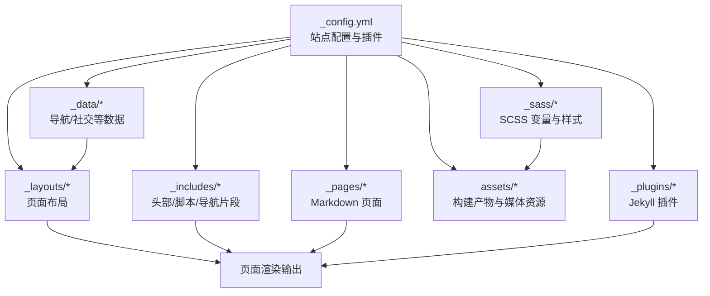
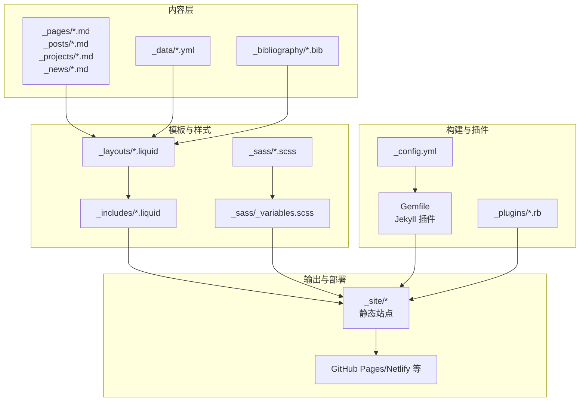
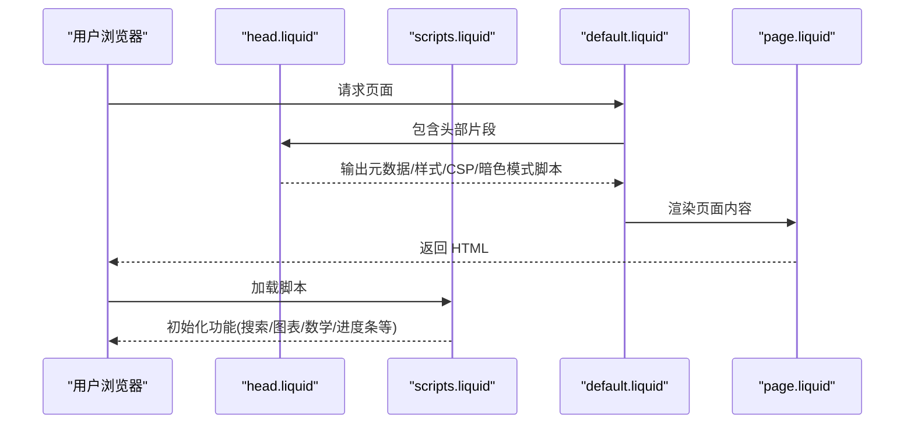
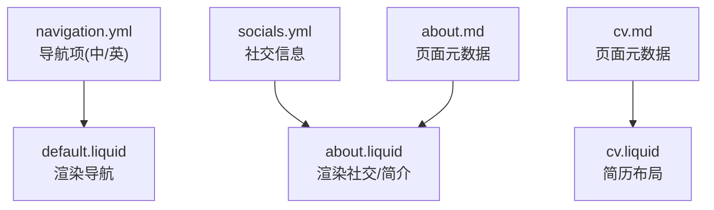
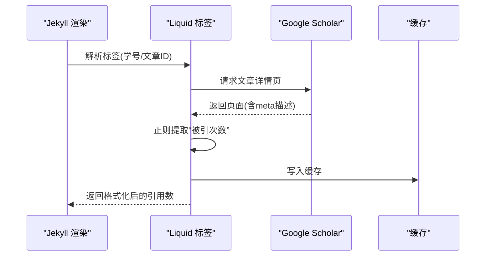
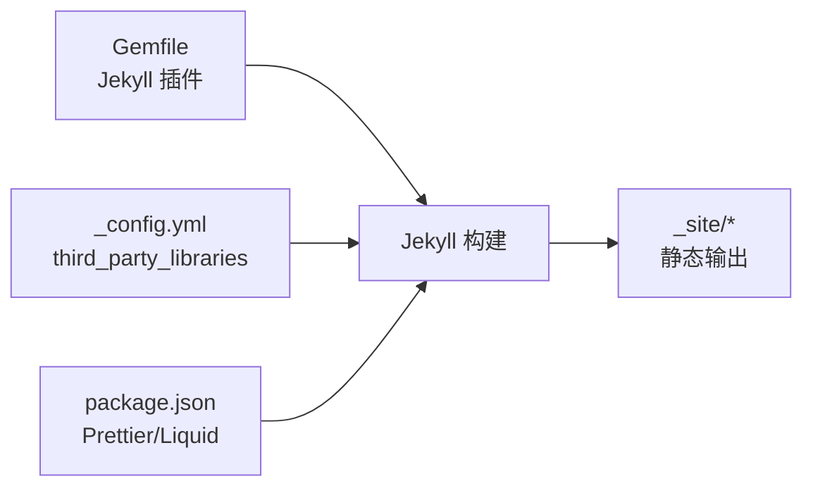

# 项目概述

<cite>
**本文引用的文件**
- [README.md](file://README.md)
- [_config.yml](file://_config.yml)
- [Gemfile](file://Gemfile)
- [package.json](file://package.json)
- [INSTALL.md](file://INSTALL.md)
- [_layouts/default.liquid](file://_layouts/default.liquid)
- [_layouts/page.liquid](file://_layouts/page.liquid)
- [_pages/about.md](file://_pages/about.md)
- [_pages/cv.md](file://_pages/cv.md)
- [_includes/head.liquid](file://_includes/head.liquid)
- [_includes/scripts.liquid](file://_includes/scripts.liquid)
- [_sass/_variables.scss](file://_sass/_variables.scss)
- [_plugins/google-scholar-citations.rb](file://_plugins/google-scholar-citations.rb)
- [_data/navigation.yml](file://_data/navigation.yml)
- [_data/socials.yml](file://_data/socials.yml)
</cite>

## 目录
1. [引言](#引言)
2. [项目结构](#项目结构)
3. [核心组件](#核心组件)
4. [架构总览](#架构总览)
5. [详细组件分析](#详细组件分析)
6. [依赖分析](#依赖分析)
7. [性能考虑](#性能考虑)
8. [故障排除指南](#故障排除指南)
9. [结论](#结论)
10. [附录](#附录)

## 引言
本项目是基于 Jekyll 的学术主页主题“al-folio”，专为个人学术主页、研究者与学生打造。它通过静态站点生成器与模板系统，提供简洁、响应式且可高度定制的页面布局，满足个人简介、研究成果展示、项目作品集、课程与教学资料、新闻公告等学术场景需求。该主题强调易用性与可维护性，适合初学者快速上手，同时为有经验的开发者提供了丰富的扩展点。

本概述将从目的、核心功能、技术架构、特色能力、部署方式等方面进行系统化说明，并结合仓库中的实际文件路径，帮助读者快速理解并高效使用该主题。

## 项目结构
该项目采用 Jekyll 标准目录组织方式，配合 Liquid 模板与 SCSS 样式，形成清晰的分层结构：
- 配置与元信息：根目录下的配置文件负责站点设置、插件启用、第三方库版本与缓存策略等
- 页面与集合：_pages 下的 Markdown 页面定义导航与内容；_posts、_projects、_news 等集合用于组织动态内容
- 布局与包含：_layouts 提供页面骨架与特定布局；_includes 负责头部、脚本、导航等可复用片段
- 数据与资源：_data 存放导航、社交账号等静态数据；_sass 定义样式变量与模块化样式；assets 放置构建后的 CSS/JS 与媒体资源
- 插件与工具：_plugins 扩展 Jekyll 功能；Gemfile/package.json 管理 Ruby 与 Node 生态依赖；Docker 与开发容器支持本地一键运行

图表来源
- [_config.yml:1-656](file://_config.yml#L1-L656)
- [_layouts/default.liquid:1-57](file://_layouts/default.liquid#L1-L57)
- [_includes/head.liquid:1-209](file://_includes/head.liquid#L1-L209)
- [_includes/scripts.liquid:1-379](file://_includes/scripts.liquid#L1-L379)
- [_sass/_variables.scss:1-53](file://_sass/_variables.scss#L1-L53)

章节来源
- [_config.yml:1-656](file://_config.yml#L1-L656)
- [_layouts/default.liquid:1-57](file://_layouts/default.liquid#L1-L57)
- [_includes/head.liquid:1-209](file://_includes/head.liquid#L1-L209)
- [_includes/scripts.liquid:1-379](file://_includes/scripts.liquid#L1-L379)
- [_sass/_variables.scss:1-53](file://_sass/_variables.scss#L1-L53)

## 核心组件
- 站点配置与插件
  - 通过 _config.yml 统一管理站点标题、作者信息、语言、URL、布局参数、搜索开关、第三方统计与分析、集合与归档、Jekyll Scholar 引文配置、图片懒加载与响应式 WebP、暗色模式、数学公式支持等
  - Gemfile 声明 Jekyll 核心插件组与开发依赖，确保构建稳定性与可重复性
  - package.json 提供 Prettier 与 Liquid 格式化工具，保障代码风格一致性
- 页面布局与包含
  - default.liquid 作为基础布局，统一注入 head 片段、头部导航、主体内容区与页脚脚本
  - page.liquid 为通用页面布局，支持自定义样式块、侧边目录、评论区等
  - head.liquid 注入元数据、安全策略、字体图标、第三方库样式、高亮主题、暗色模式脚本等
  - scripts.liquid 条件加载各类前端库与功能脚本，如图表、Mermaid、数学公式、Cookie 同意、搜索、进度条等
- 内容与数据
  - _pages/about.md 与 _pages/cv.md 定义首页与简历页的布局、永久链接、导航顺序与目录侧边栏
  - _data/navigation.yml 与 _data/socials.yml 提供导航菜单与社交链接数据
- 主题与样式
  - _sass/_variables.scss 定义颜色、字体、间距、最大宽度等主题变量，便于全局定制
- 插件扩展
  - _plugins/google-scholar-citations.rb 提供 Google Scholar 引文计数的 Liquid 标签，实现按文章 ID 动态抓取并缓存

章节来源
- [_config.yml:1-656](file://_config.yml#L1-L656)
- [Gemfile:1-42](file://Gemfile#L1-L42)
- [package.json:1-7](file://package.json#L1-L7)
- [_layouts/default.liquid:1-57](file://_layouts/default.liquid#L1-L57)
- [_layouts/page.liquid:1-32](file://_layouts/page.liquid#L1-L32)
- [_includes/head.liquid:1-209](file://_includes/head.liquid#L1-L209)
- [_includes/scripts.liquid:1-379](file://_includes/scripts.liquid#L1-L379)
- [_pages/about.md:1-39](file://_pages/about.md#L1-L39)
- [_pages/cv.md:1-13](file://_pages/cv.md#L1-L13)
- [_data/navigation.yml:1-24](file://_data/navigation.yml#L1-L24)
- [_data/socials.yml:1-6](file://_data/socials.yml#L1-L6)
- [_sass/_variables.scss:1-53](file://_sass/_variables.scss#L1-L53)
- [_plugins/google-scholar-citations.rb:1-87](file://_plugins/google-scholar-citations.rb#L1-L87)

## 架构总览
下图展示了从内容到渲染输出的整体流程：内容文件（Markdown/数据）经由 Jekyll 渲染引擎与插件处理，结合 Liquid 模板与 SCSS 编译，最终生成静态 HTML/CSS/JS 并部署至托管平台。

图表来源
- [_config.yml:1-656](file://_config.yml#L1-L656)
- [_layouts/default.liquid:1-57](file://_layouts/default.liquid#L1-L57)
- [_includes/head.liquid:1-209](file://_includes/head.liquid#L1-L209)
- [_includes/scripts.liquid:1-379](file://_includes/scripts.liquid#L1-L379)
- [_sass/_variables.scss:1-53](file://_sass/_variables.scss#L1-L53)
- [Gemfile:1-42](file://Gemfile#L1-L42)
- [_plugins/google-scholar-citations.rb:1-87](file://_plugins/google-scholar-citations.rb#L1-L87)

章节来源
- [_config.yml:1-656](file://_config.yml#L1-L656)
- [Gemfile:1-42](file://Gemfile#L1-L42)
- [_layouts/default.liquid:1-57](file://_layouts/default.liquid#L1-L57)
- [_includes/head.liquid:1-209](file://_includes/head.liquid#L1-L209)
- [_includes/scripts.liquid:1-379](file://_includes/scripts.liquid#L1-L379)
- [_sass/_variables.scss:1-53](file://_sass/_variables.scss#L1-L53)

## 详细组件分析

### 页面与布局组件
- 基础布局 default.liquid
  - 负责注入 head 片段、头部导航、主体容器与页脚脚本
  - 支持可选侧边目录与内容主次区域布局
- 通用页面布局 page.liquid
  - 支持页面级自定义样式块、标题与描述、相关文献引用、评论区等
- 头部与脚本包含
  - head.liquid 注入元数据、CSP、字体图标、第三方库样式、高亮主题、暗色模式脚本
  - scripts.liquid 条件加载图表、Mermaid、数学公式、Cookie 同意、搜索、进度条、图片库等

图表来源
- [_layouts/default.liquid:1-57](file://_layouts/default.liquid#L1-L57)
- [_layouts/page.liquid:1-32](file://_layouts/page.liquid#L1-L32)
- [_includes/head.liquid:1-209](file://_includes/head.liquid#L1-L209)
- [_includes/scripts.liquid:1-379](file://_includes/scripts.liquid#L1-L379)

章节来源
- [_layouts/default.liquid:1-57](file://_layouts/default.liquid#L1-L57)
- [_layouts/page.liquid:1-32](file://_layouts/page.liquid#L1-L32)
- [_includes/head.liquid:1-209](file://_includes/head.liquid#L1-L209)
- [_includes/scripts.liquid:1-379](file://_includes/scripts.liquid#L1-L379)

### 内容与导航组件
- 导航数据 navigation.yml
  - 定义英文与中文导航项及对应 URL，支持多语言切换
- 社交数据 socials.yml
  - 定义邮箱、GitHub 用户名、ORCID 等社交信息，供模板调用
- 页面示例
  - about.md 定义首页布局、永久链接、头像信息、精选论文与社交展示开关、公告与最新文章配置
  - cv.md 定义简历页布局、永久链接、导航顺序与侧边目录

图表来源
- [_data/navigation.yml:1-24](file://_data/navigation.yml#L1-L24)
- [_data/socials.yml:1-6](file://_data/socials.yml#L1-L6)
- [_pages/about.md:1-39](file://_pages/about.md#L1-L39)
- [_pages/cv.md:1-13](file://_pages/cv.md#L1-L13)

章节来源
- [_data/navigation.yml:1-24](file://_data/navigation.yml#L1-L24)
- [_data/socials.yml:1-6](file://_data/socials.yml#L1-L6)
- [_pages/about.md:1-39](file://_pages/about.md#L1-L39)
- [_pages/cv.md:1-13](file://_pages/cv.md#L1-L13)

### 插件与扩展组件
- google-scholar-citations.rb
  - 实现 Liquid 标签，按 Google Scholar 文章 ID 抓取“被引次数”，解析 meta 标签并缓存结果，避免重复请求
  - 在渲染阶段动态获取并显示引用计数，提升研究成果展示的真实度与自动化程度

图表来源
- [_plugins/google-scholar-citations.rb:1-87](file://_plugins/google-scholar-citations.rb#L1-L87)

章节来源
- [_plugins/google-scholar-citations.rb:1-87](file://_plugins/google-scholar-citations.rb#L1-L87)

### 样式与主题组件
- SCSS 变量与主题
  - _sass/_variables.scss 定义颜色体系、背景色、代码高亮背景、图标路径、回到顶部按钮尺寸等
  - 通过 SCSS 模块化组织，便于主题切换与品牌定制

章节来源
- [_sass/_variables.scss:1-53](file://_sass/_variables.scss#L1-L53)

## 依赖分析
- Ruby 与 Jekyll 插件
  - Gemfile 声明核心插件组，覆盖归档、缓存、邮件保护、订阅源、JSON 获取、图片处理、Jupyter Notebook、链接属性、压缩、分页、正则替换、Scholar、Sitemap、社交、Tabs、Terser、TOC、Twitter、Emoji 等
- 第三方库与版本
  - _config.yml 中 third_party_libraries 字段集中声明常用前端库（如 Bootstrap、Chart.js、Mermaid、MathJax、Medium Zoom、Photoswipe、Leaflet、ECharts、Swiper 等），并提供完整性校验哈希与 CDN 地址，确保安全性与可复现性
- 开发与格式化
  - package.json 提供 Prettier 与 Liquid 格式化工具，保证模板与静态资源风格一致

图表来源
- [Gemfile:1-42](file://Gemfile#L1-L42)
- [_config.yml:405-634](file://_config.yml#L405-L634)
- [package.json:1-7](file://package.json#L1-L7)

章节来源
- [Gemfile:1-42](file://Gemfile#L1-L42)
- [_config.yml:405-634](file://_config.yml#L405-L634)
- [package.json:1-7](file://package.json#L1-L7)

## 性能考虑
- 构建优化
  - jekyll-minifier 与 terser 配置减少 JS/CSS 体积；保留必要文件排除列表，避免误压缩
  - jekyll-cache-bust 与 bust_file_cache/ bust_css_cache 机制确保缓存失效与资源更新
- 图片与媒体
  - 启用 lazy_loading_images 与 jekyll-imagemagick 的响应式 WebP 生成，降低带宽与首屏时间
- 运行时性能
  - 条件加载第三方库与功能脚本，仅在需要的页面加载对应资源
  - 搜索、图表、数学公式等按需引入，避免不必要的脚本阻塞

章节来源
- [_config.yml:233-244](file://_config.yml#L233-L244)
- [_config.yml:350-376](file://_config.yml#L350-L376)
- [_includes/scripts.liquid:1-379](file://_includes/scripts.liquid#L1-L379)
- [_includes/head.liquid:1-209](file://_includes/head.liquid#L1-L209)

## 故障排除指南
- 本地开发与 Docker
  - 使用 Docker Compose 快速启动本地环境；首次运行会拉取镜像；若出现依赖问题，可通过日志定位并进入容器执行安装脚本
- 自动部署与 GitHub Pages
  - 启用 GitHub Actions 工作流后，推送即自动触发部署；确保 Pages 设置指向生成分支
- 依赖升级与兼容
  - 通过 bundle update 更新 Ruby 依赖；如升级后页面异常，参考 FAQ 或回退版本并重新构建
- 搜索与第三方集成
  - 搜索功能依赖特定脚本与数据；若搜索不可用，检查脚本加载顺序与占位符配置
  - 分析与 Cookie 同意脚本受 Cookie 同意控制，需确保用户授权后再加载

章节来源
- [INSTALL.md:70-133](file://INSTALL.md#L70-L133)
- [INSTALL.md:154-182](file://INSTALL.md#L154-L182)
- [INSTALL.md:259-297](file://INSTALL.md#L259-L297)
- [_includes/scripts.liquid:226-300](file://_includes/scripts.liquid#L226-L300)

## 结论
本项目以“al-folio”为主题，围绕 Jekyll 与 Liquid 模板系统，构建了面向学术主页的完整解决方案。通过清晰的目录结构、可扩展的布局与包含、完善的插件生态与第三方库集成，以及对性能与隐私的细致考量，既满足初学者的快速上手需求，也为高级用户提供深度定制空间。结合本概述提供的架构视图与组件说明，用户可以高效地完成个人主页的搭建、维护与迭代。

## 附录
- 快速开始与安装部署
  - 参考 INSTALL.md 的推荐流程，优先使用模板而非 Fork；支持 Docker 本地开发与自动部署至 GitHub Pages/Netlify
- 主题与样式定制
  - 通过 _sass/_variables.scss 调整颜色与排版；在 _config.yml 中启用/禁用功能与第三方库
- 多语言与导航
  - 利用 _data/navigation.yml 与页面元数据实现中/英双语导航与内容切换

章节来源
- [INSTALL.md:30-34](file://INSTALL.md#L30-L34)
- [INSTALL.md:188-205](file://INSTALL.md#L188-L205)
- [_sass/_variables.scss:1-53](file://_sass/_variables.scss#L1-L53)
- [_data/navigation.yml:1-24](file://_data/navigation.yml#L1-L24)